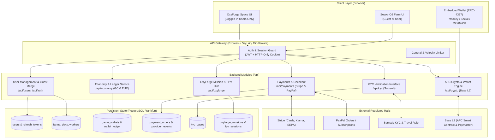

# Enhanced Detail Implementation Plan: SearchO2 + OxyForge Economy, AFC Crypto, Payments, KYC & User Management

**Target Jurisdiction:** Germany (DE) & European Union (EU)  
**Applicable Legal Frameworks:** MiCA (Regulation EU 2023/1114), GwG (Geldwäschegesetz / AMLD6), ZAG (Zahlungsdiensteaufsichtsgesetz), KWG (Kreditwesengesetz), GDPR / DSGVO (Regulation EU 2016/679), EU Transfer of Funds Regulation (TFR 2023/1113).  
**Initial Starting Money:** €10,000 Game Money (SearchO2)  
**Conversion Matrix:** €1.00 Real EUR = 200 AFC = 2,000€ Game Money  
**Target Git Branches:** `oxyforge-v1` ➔ `searcho2-oxyf-v1` ➔ `mvp-v1` ➔ `main`

---

## 1. Executive Summary & Regulatory Architecture (Germany & EU)

### 1.1 The Stated Conversion Rate & Token Classification
The requested economic relationship is:
$$\text{€1.00 Real EUR} = 200 \text{ AFC} = \text{2,000€ Game Money}$$
- **1 AFC = 10.00€ Game Money = €0.005 Real EUR (0.5 Euro Cent)**
- **€1.00 Real EUR = 2,000.00€ Game Money** (10x purchasing leverage in-game)
- **Initial Starting Balance = 10,000.00€ Game Money** (equivalent to 1,000 AFC or €5.00 nominal value)

### 1.2 German & EU Regulatory Constraints

#### A. MiCA (Markets in Crypto-Assets - Regulation EU 2023/1114)
- **Risk Analysis:** If AFC promises fixed 1:1 or pegged redemption back to fiat Euro (€1 = 200 AFC), it risks classification by BaFin (Federal Financial Supervisory Authority / *Bundesanstalt für Finanzdienstleistungsaufsicht*) as an **Electronic Money Token (EMT)** under MiCA Title IV or an **Asset-Referenced Token (ART)** under Title III.
- Under MiCA Article 48, **only authorized credit institutions and Electronic Money Institutions (EMIs)** licensed under Directive 2009/110/EC are permitted to issue EMTs in the European Union. Operating an unlicensed EMT issuance carries criminal and administrative sanctions under the German Payment Services Supervision Act (*Zahlungsdiensteaufsichtsgesetz - ZAG*).
- **Startup-Compliant Solution:**
  1. **In-Game Game Credits (GC / Game Money):** Closed-loop, non-refundable virtual currency within the gaming environment. Does not qualify as a crypto-asset under MiCA Art. 2(4)(a) (non-fungible / closed-loop utility).
  2. **AFC Token (On-Chain):** Deployed as a standard ERC-20 utility token on a cost-efficient Layer 2 (Base L2). Represents ecological agro-forestry proof-of-cultivation.
  3. **Fiat On/Off-Ramp via Licensed Partner:** Rather than the startup holding fiat customer deposits in an unregulated corporate bank account, integrate with an authorized **EU Crypto-Asset Service Provider (CASP) or licensed EMI** (e.g. Stripe Crypto Onramp, Monerium EURe, or MoonPay). The licensed partner conducts KYC, accepts EUR via SEPA/Cards, and mints/distributes tokens to the user's wallet.

#### B. German AML & KYC (Geldwäschegesetz - GwG & AMLD6)
- Digital game platforms offering token conversions must enforce AML controls when transactions exceed €1,000 single or cumulative thresholds.
- Identity verification must comply with BaFin Circular 03/2017 (GW) on video/online identification, or automated eID (German *Personalausweis* eID function) or certified liveness checks.

#### C. EU Transfer of Funds Regulation (TFR - Regulation EU 2023/1113 / Travel Rule)
- When users transfer AFC to self-hosted external wallets (e.g. MetaMask/Rabby) in amounts exceeding €1,000, CASP infrastructure must verify proof of wallet ownership and screen destination addresses against EU and OFAC sanctions lists.

#### D. GDPR / DSGVO (Regulation EU 2016/679)
- **Article 17 (Right to Erasure / *Recht auf Vergessenwerden*):** Public blockchains are immutable and cannot erase data. **Zero Personally Identifiable Information (PII)** may be recorded on-chain.
- The PostgreSQL database hosted in Frankfurt (`eu-central-1`) remains the sole repository of user identity, emails, passwords, and KYC case references. On-chain addresses remain pseudonymous hex hashes.

---

## 2. Technology Selection for Fresh Startup & Budget Constraints

| Domain | Selected Technology | Alternative Evaluated | Why Selected (Startup Justification) |
| :--- | :--- | :--- | :--- |
| **Blockchain** | **Base L2** (Coinbase / OP Stack) | Polygon PoS, Arbitrum, Solana | Average gas fee **< €0.002** (sub-cent), EVM standard (Solidity), direct Coinbase on-ramp liquidity, Circle EURC/USDC native, instant ~2s finality, zero infrastructure maintenance. |
| **Wallet Layer** | **ERC-4337 Account Abstraction with Embedded Wallets** (Privy or Biconomy) | Plain MetaMask, Web3Auth | Players log in with Email, Google, or Passkey. Embedded MPC wallet created seamlessly. Gasless sponsored transactions via ERC-4337 Paymaster (users don't need ETH for gas). |
| **Payment Rails** | **Stripe European Unified Billing** + **PayPal REST v2** | Adyen, Mangopay | Handles Visa, Mastercard, SEPA Instant Credit & Direct Debit, Klarna (Sofort), Apple/Google Pay in one unified SDK. Low barrier to entry, no upfront monthly enterprise minimums. |
| **KYC Interface** | **Sumsub WebSDK** | Veriff, IDnow | Full European coverage (German ID, EU Passports, liveness), integrated PEP/sanctions screening, built-in Travel Rule module, startup tier (~€1.20/check). |
| **Backend Engine** | **Node.js / Express / TypeScript** with PostgreSQL 18 & Redis | Go / Python | Extends existing `backend/` architecture seamlessly without adding polyglot runtime complexity. |

---

## 3. Data Model & Architecture Diagram



---

## 4. User Management & Guest Profile Merge Design

### 4.1 Guest Identity & Cross-Browser Mechanics
1. **Current Behavior:**
   - In SearchO2, guests play without submitting personal data. Each browser generates an independent UUID in localStorage or via `POST /api/auth/guest`.
2. **Guest Recovery Code Generation:**
   - When a guest starts playing, the backend issues an optional recovery token:
     `GUEST-XXXX-XXXX-XXXX` (128-bit entropy, hashed with SHA-256 before database storage).
3. **Registration Flow Choices:**
   - In the registration modal/form, the user is presented with two explicit paths:
     - **Path 1 (Merge Existing Guest):** User enters `guestId` or `recoveryCode`. The backend merges the guest's farm, buildings, equipment, plots, and achievements into the new registered account.
     - **Path 2 (Start Fresh):** User leaves it blank or clicks "Start Fresh with €10,000". A clean starter farm with 10,000.00€ Game Money is created.
4. **Merge Protection Rules:**
   - Atomic PostgreSQL transaction using `SELECT ... FOR UPDATE`.
   - Prevent duplicate starter grants (if guest already had €10,000, don't double it to €20,000).
   - Invalidate all guest refresh tokens immediately.
   - Retain farm history in append-only ledger with `transaction_type = 'guest_merge'`.

### 4.2 OxyForge Logged-In Restriction
- OxyForge requires an authenticated session (`isGuest === false`).
- If an unauthenticated user or guest navigates to `/oxyforge/`, the game renders the **Astronaut Gatekeeper Dialog**:
  - *"OxyForge Space Operations require an authorized Commander Account."*
  - Buttons: **Sign In** or **Register & Claim Farm Progress**.

---

## 5. Branch Management & Execution Sequence

```mermaid
gitGraph
   commit id: "Current mvp-v1"
   branch oxyforge-v1
   checkout oxyforge-v1
   commit id: "Unpack OxyForge-latest-updates.zip"
   commit id: "Update README.md (€10k, AFC, Auth)"
   checkout mvp-v1
   branch searcho2-oxyf-v1
   checkout searcho2-oxyf-v1
   commit id: "DB Migrations: Wallets, KYC, Payments"
   commit id: "Implement User Management & Guest Merge"
   commit id: "Implement Economy & AFC Ledger Engine"
   commit id: "Implement Crypto & Base L2 Service"
   commit id: "Implement Stripe & PayPal Payments"
   commit id: "Implement Sumsub KYC Interface"
   commit id: "Port OxyForge R3F & Auth Gate"
   commit id: "Headless Verification & Integration Tests"
   checkout mvp-v1
   merge searcho2-oxyf-v1
   checkout main
   merge mvp-v1
   commit id: "Deploy Live"
```

1. **Step 1: Update `oxyforge-v1` Branch**
   - Check out `oxyforge-v1` (`git checkout -B oxyforge-v1 origin/oxyforge-v1`).
   - Extract files from `OxyForge-latest-updates.zip` into the branch.
   - Update `README.md` to document the €10,000 starting budget, AFC tokenomics (`1€ = 200 AFC = 2,000€ Game`), and login requirements.
   - Commit and push to `origin/oxyforge-v1`.
2. **Step 2: Create `searcho2-oxyf-v1` Branch**
   - Check out `searcho2-oxyf-v1` branching off `mvp-v1`.
3. **Step 3: Backend Implementation on `searcho2-oxyf-v1`**
   - Database schema migration `002_oxyforge_economy_crypto_schema.sql`.
   - Update `auth.service.ts` and `user.service.ts` with guest merge.
   - Create `backend/src/modules/crypto/` with Base L2 & ERC-4337 signatures.
   - Create `backend/src/modules/payments/` with Stripe & PayPal signatures.
   - Create `backend/src/modules/kyc/` with Sumsub signatures.
   - Create `backend/src/modules/oxyforge/` with mission and FPV APIs.
   - Mount new routers in `backend/src/index.ts`.
4. **Step 4: Verification & Merging**
   - Run unit and headless simulation tests.
   - Merge `searcho2-oxyf-v1` into `mvp-v1` and `main`.
   - Push to `origin`.

---

## 6. Detailed Backend Module Specifications with #TODO Markings & Signatures

### 6.1 Database Schema Migration: `002_oxyforge_economy_crypto_schema.sql`
- `game_wallets`: User-scoped balances for `GC` (Game Credits), `AFC` (Crypto units), and `EUR` (Cents).
- `wallet_ledger`: Double-entry append-only transactions with unique `idempotency_key`.
- `guest_merges`: Audit log of source guest UUIDs merged into destination user accounts.
- `payment_orders`: Tracking Stripe and PayPal sessions.
- `provider_events`: Webhook event deduplication.
- `kyc_cases`: Verification case references and AML status.
- `oxyforge_missions`: Active and past space mission telemetry.
- `oxyforge_fpv_sessions`: Real-time billing session tracking.

### 6.2 Module Structure Overview
```
backend/src/
├── modules/
│   ├── auth/
│   │   ├── auth.service.ts          # Updated with registerWithGuestMerge()
│   │   └── auth.controller.ts       # Updated POST /api/auth/register
│   ├── users/
│   │   ├── user.service.ts          # Guest merge business logic
│   │   └── user.controller.ts       # POST /api/users/merge-guest
│   ├── economy/
│   │   ├── economy.service.ts       # Multi-asset conversion (1€:200 AFC:2000 GC)
│   │   └── economy.controller.ts    # POST /api/economy/transfer
│   ├── crypto/
│   │   ├── crypto.service.ts        # Base L2, ERC-20 AFC contract, Paymaster
│   │   ├── crypto.controller.ts     # /api/crypto routes
│   │   └── crypto.types.ts
│   ├── payments/
│   │   ├── payments.service.ts      # Stripe (Cards, Klarna, SEPA) & PayPal API
│   │   ├── payments.controller.ts   # /api/payments & webhooks
│   │   └── payments.types.ts
│   ├── kyc/
│   │   ├── kyc.service.ts           # Sumsub KYC SDK & Travel Rule checks
│   │   ├── kyc.controller.ts        # /api/kyc & webhooks
│   │   └── kyc.types.ts
│   └── oxyforge/
│       ├── oxyforge.service.ts      # Mission launch, checklist, FPV billing
│       ├── oxyforge.controller.ts   # /api/oxyforge (strictly requireAuth)
│       └── oxyforge.types.ts
```
