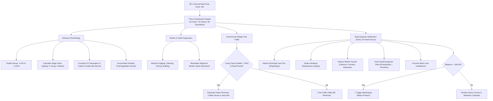
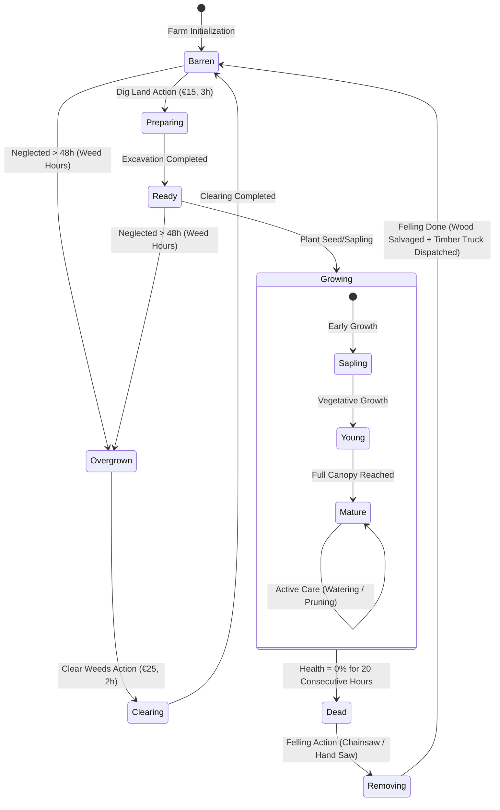
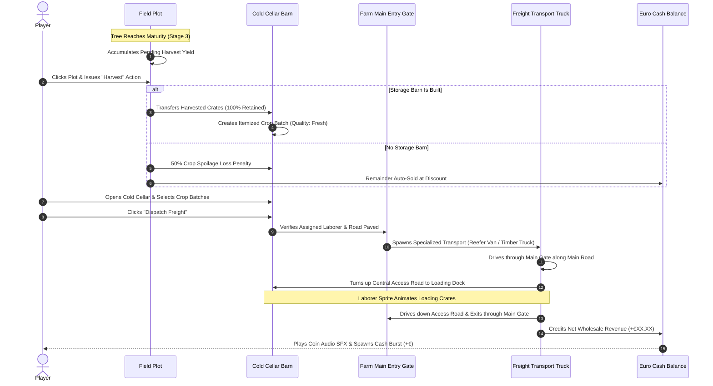
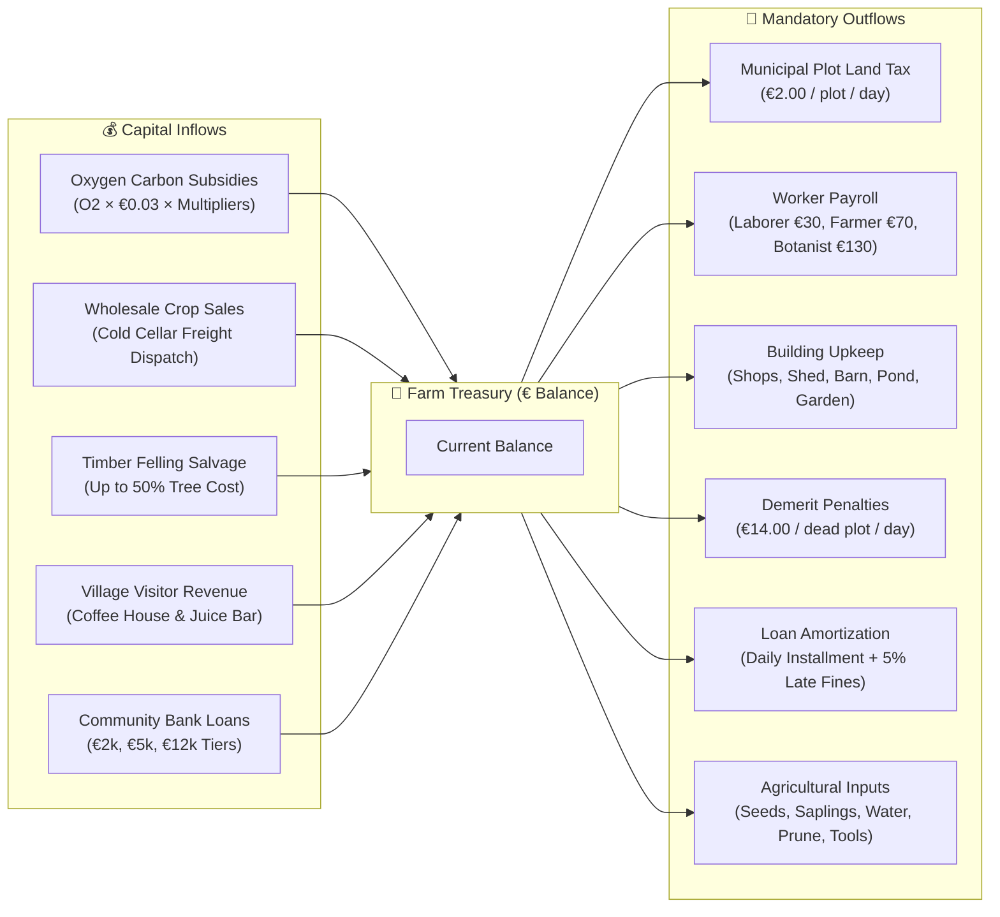
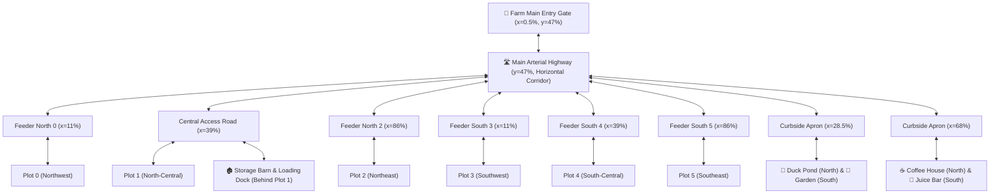

# 🌿 searchO2 — Regenerative Agroforestry & Oxygen Economy Simulation

[](https://searcho2.online)
[](LICENSE)
[](index.html)
[](backend/)
[](backend/)
[](index.html)

> **searchO2** is an educational, single-page browser farming and ecosystem simulation game. Players transform barren, depleted land into a thriving, self-sustaining green community. The game blends ecological principles—carbon sequestration, multi-strata agroforestry, soil biology, and regional biodiversity—with a balanced virtual Euro economy driven by oxygen production, crop logistics, and eco-tourism.

---

## 📑 Table of Contents
1. [Core Concepts & Philosophy](#-core-concepts--philosophy)
2. [Gameplay Quickstart & Instructions](#-gameplay-quickstart--instructions)
3. [Interactive Architecture & System Flows](#-interactive-architecture--system-flows)
   - [Core Gameplay Simulation Loop](#1-core-gameplay-simulation-loop)
   - [Plot Lifecycle State Machine](#2-plot-lifecycle-state-machine)
   - [Harvest & Freight Logistics Pipeline](#3-harvest--freight-logistics-pipeline)
   - [Macro-Economic Balance & Cash Flow](#4-macro-economic-balance--cash-flow)
   - [Manhattan Road & Waypoint Navigation](#5-manhattan-road--waypoint-navigation)
4. [Deep Dive: Game Mechanics & Subsystems](#-deep-dive-game-mechanics--subsystems)
   - [Plot Management & Biological Health Decay](#plot-management--biological-health-decay)
   - [Tree Taxonomy & Agricultural Catalog](#tree-taxonomy--agricultural-catalog)
   - [Labor & Crew Management](#labor--crew-management)
   - [Infrastructure, Roads & Village Commons](#infrastructure-roads--village-commons)
   - [Oxygen Economy, Logistics & Finance](#oxygen-economy-logistics--finance)
   - [Ecosystem Synergies & Visitor Foot-Traffic](#ecosystem-synergies--visitor-foot-traffic)
   - [Wildlife Encounters & Seasonal Cycles](#wildlife-encounters--seasonal-cycles)
   - [Planetary Biomes & Interactive 3D World Globe](#planetary-biomes--interactive-3d-world-globe)
   - [Procedural Regional Soundtrack & SFX Engine](#procedural-regional-soundtrack--sfx-engine)
5. [User Interface & Zen HUD Design](#-user-interface--zen-hud-design)
6. [Technical Architecture & Security](#-technical-architecture--security)
7. [Getting Started & Local Development](#-getting-started--local-development)
8. [Automated Testing & Verification](#-automated-testing--verification)
9. [Project Delivery Roadmap](#-project-delivery-roadmap)
10. [Contributing & License](#-contributing--license)

---

## 🌍 Core Concepts & Philosophy

```
  ┌────────────────────────────────────────────────────────────────────────┐
  │                           searchO2 ECOSYSTEM                           │
  │                                                                        │
  │     [Barren Land] ──► [Soil Prep] ──► [Agroforestry Planting]          │
  │            ▲                                  │                        │
  │            │                                  ▼                        │
  │     [Eco Recovery]                    [Oxygen Production]              │
  │            ▲                                  │                        │
  │            │                                  ▼                        │
  │     [Village Amenities] ◄── [Logistics] ◄── [Virtual Euro Income]      │
  └────────────────────────────────────────────────────────────────────────┘
```

### 1. Regenerative Agroforestry
Unlike conventional farming games that model soil as an infinite nutrient faucet, **searchO2** treats land as a living, delicate organism:
- **Oxygen as Currency:** Every healthy tree continuously captures carbon and generates Oxygen ($O_2$). This output is converted into municipal green subsidies ($\text{€0.03}$ per unit of $O_2$), modeling real-world carbon credits.
- **Multi-Strata Biodiversity:** Monocultures suffer penalties. Planting diverse species (fruit trees, timber, evergreens, and flowering pollinators) activates compounding biodiversity multipliers.
- **Living Biological Vigor:** Left neglected, crops dehydrate, lose chlorophyll, wither, and die. Untended dead trees rot on the plots, racking up daily environmental demerit fines.

### 2. Educational Responsibility (COPPA & Classroom-Ready)
- **Real Biological Data:** Each of the 18 tree species contains curated botanical profiles detailing actual photosynthesis rates, canopy spread, water footprints, and wildlife benefits.
- **Child-Safe & Inclusive:** Designed for children ages 8+, families, and schools. No pay-to-win microtransactions, no gambling mechanics, and zero open inter-player text chat.
- **Guest-First Accessibility:** Frictionless 1-click guest onboarding with offline catch-up simulation ensures immediate classroom usability without forced personal data collection.

---

## 🎮 Gameplay Quickstart & Instructions

### Step 1: Examine Your Farmstead
You start in the Central European Grassland (Germany) with **€50.00** in starting capital and **6 barren agricultural plots**.

### Step 2: Excavate & Prepare the Soil
1. Click on any uncultivated plot marked **Barren**.
2. Select **Dig Land (€15 · 3h)**.
3. The plot transitions to `preparing`. Once excavation finishes, it becomes fertile `ready` soil.

### Step 3: Plant Your First Canopy
1. Click the `ready` plot to open the **Tree Nursery**.
2. Select an initial tree suited to your strategy:
   - **Fruit Tree (e.g., Apple €90):** Provides steady oxygen and edible fruit harvest.
   - **Vegetable (e.g., Tomato €35):** Fast-growing canopy with rapid cash turnaround.
   - **Oxygen Tree (e.g., Oak €120):** Highest long-term $O_2$ yield and municipal credits.
3. Your seedling enters the `growing` stage as a delicate **Sapling**.

### Step 4: Biological Care & Irrigation
- Trees naturally lose hydration and vigor over time.
- Click a growing plot to inspect its real-time **Health Bar** ($0\% - 100\%$).
- Keep health above **80%** by performing:
  - 💧 **Water Plot (€8 · 2h):** Restores $+30\%$ hydration.
  - ✂️ **Prune Tree (€12 · 3h):** Eliminates dead branches and restores $+20\%$ vigor.
  - ⚡ **Install Automated Drip Irrigation (€80):** Permanently boosts growth rate by $+15\%$.

### Step 5: Construct the Cold Cellar Barn & Loading Bay
- Mature crops accumulate `pendingHarvest`.
- **Crucial Rule:** Harvesting without storage causes **$50\%$ spoilage penalty**.
- Click the Upper Yard behind Plot 1 to construct the **Storage Barn (€550 · 10h)**.
- Stored crops are preserved in a climate-controlled cold cellar ($4.2^\circ\text{C}$, $85\%$ RH).

### Step 6: Dispatch Freight & Sell Stored Goods
1. Click the **Storage Barn** to open the **Cold Cellar Inventory**.
2. Select itemized batches of produce or timber.
3. Ensure a **Laborer** is hired to operate the loading bay.
4. Click **Dispatch Freight**: An animated transport truck enters through the Farm Main Gate, loads crates at the loading dock, and exits to market, crediting Euro revenue with coin sound effects!

### Step 7: Pave the Road & Expand into Village Commerce
1. Click the road corridor to construct the **Main Arterial Road (€250 · 4h)**.
2. Paving the road unlocks curbside village amenities across the opposing promenade:
   - 🌷 **Botanical Flower Garden (€300):** Boosts farm reputation ($+8$).
   - 🦆 **Duck & Fish Pond (€400):** Streams physical fish and duck products into storage.
   - ☕ **The Coffee House (€800):** Serves strolling village visitors.
   - 🧃 **The Juice & Ice Bar (€700):** Serves fresh smoothies to tourists.

### Step 8: Manage Debt & Avoid Bankruptcy
- Inactive, neglected farms lose money! If plots stay dead or overgrown, municipal fines (€14/plot/day) and estate taxes (€12/day) will push your balance below **€0.00**.
- Dropping below **-€50.00** triggers an emergency **Bankruptcy Protocol** from the Community Bank, requiring loan restructuring or emergency debt relief.

---

## 🔄 Interactive Architecture & System Flows

### 1. Core Gameplay Simulation Loop



---

### 2. Plot Lifecycle State Machine



---

### 3. Harvest & Freight Logistics Pipeline



---

### 4. Macro-Economic Balance & Cash Flow



---

### 5. Manhattan Road & Waypoint Navigation



---

## 🔬 Deep Dive: Game Mechanics & Subsystems

### Plot Management & Biological Health Decay
Each plot tracks distinct biological telemetry:
- **Health Decay Rate:** Trees continuously burn metabolic energy. Health drops every game-hour based on tree category:
  $$\text{Fruit Trees: } -0.8\%/\text{h} \quad|\quad \text{Evergreen: } -0.4\%/\text{h} \quad|\quad \text{Deciduous: } -0.5\%/\text{h}$$
- **Chlorophyll Cut-Off (Health $\le 20\%$):** When health drops to or below 20%, photosynthesis and fruiting cease completely ($\text{healthMult} = 0$).
- **Zero-Health Streak & Tree Death:** If health sits at $0\%$ for **20 consecutive game-hours** (`TREE_DRY_THRESHOLD_HOURS`), the tree dies (`status: 'dead'`).
- **Demerit Fines on Rot:** Dead trees left unchopped incur an environmental violation fine of **€14.00 per plot per day** plus 1 Demerit per day. 6 dead plots incur **€84.00/day**, rapidly pulling neglected farms into negative balance.

---

### Tree Taxonomy & Agricultural Catalog

The nursery features **18 authentic species** spanning 5 botanical categories:

| Category | Species | Cost | Growth (h) | Max O₂/h | Late Bonus | Care Profile |
|---|---|:---:|:---:|:---:|:---:|---|
| **Oxygen Trees** | Oak, Pine, Maple, Poplar | €120–€180 | 48h–72h | **6.0–8.5** | — | Deep rooting, slow decay, high carbon sequestration |
| **Fruit Trees** | Apple, Orange, Lemon, Mango | €90–€140 | 36h–48h | 3.5–4.5 | **€0.90–€1.40/h** | Requires frequent watering; high commercial value |
| **Vegetables** | Tomato, Potato, Carrot, Onion | €35–€50 | 18h–24h | 1.0–1.8 | **€0.60–€0.85/h** | Fast cash turnaround; high vulnerability to drought |
| **Timber Trees** | Teak, Cedar, Eucalyptus | €160–€220 | 80h–120h | 4.0–5.5 | **€35–€65 Wood** | Heavy wood salvage payoff upon planned harvest |
| **Biodiversity** | Cherry Blossom, Birch, Acacia | €85–€115 | 30h–42h | 3.0–4.0 | **+Pollinators** | Grants $+3$ to $+5$ Farm Reputation and bee visits |

---

### Labor & Crew Management

Building the **Crew Shed (€200)** unlocks the worker recruitment roster:

| Class | Wage/Day | Speed Multiplier | Autonomous Capabilities |
|---|:---:|:---:|---|
| **Laborer** 👷 | €30.00 | $+50\%$ Task Speed | Excavates soil, clears overgrowth, chops dead trees, and operates storage loading docks. |
| **Farmer** 🧑‍🌾 | €70.00 | $+40\%$ Vegetative Growth | Plants saplings, performs scheduled watering/pruning, and harvests crops into storage. |
| **Specialist Botanist** 👩‍🔬 | €130.00 | $+60\%$ Vegetative Growth | Formulates bio-fertilizer, prevents diseases, and logs periodic diagnostic reports. |
| **Engineer** 🛠️ | €180.00 | $+10\%$ Global Efficiency | Maintains automated drip irrigation and grants a $+10\%$ passive revenue boost. |

*Visual Pathfinding:* Workers assigned to tasks physically walk along the paved road network and feeder paths using real-time Manhattan waypoint vectors (`animateWorkerPathWalk`).

---

### Infrastructure, Roads & Village Commons

```
  Upper Yard (Top):        [ Storage Barn & Loading Dock ] (behind Plot 1)
  North Field:             [ Plot 0 ]      [ Plot 1 ]      [ Plot 2 ]
  North Amenities:                 [ Duck Pond ]       [ Coffee House ]
  ────────────────────────────────────────────────────────────────────────
  Main Arterial Road:  ═════════════════ Paved Highway ═══════════════════
  ────────────────────────────────────────────────────────────────────────
  South Amenities:                 [ Garden ]          [ Juice Bar ]
  South Field:             [ Plot 3 ]      [ Plot 4 ]      [ Plot 5 ]
  West Entrance:       [ Main Entry Gate ]
```

1. **Storage Barn Depot:** Climate-controlled cold storage. Protects goods from $50\%$ spoilage, maintains discrete crop batches, and supports capacity expansions ($+150$ capacity for €500).
2. **Main Arterial Road & Feeder Network:** Interlocking cobblestone highway connecting the Main Gate to all plots and amenities.
3. **Botanical Flower Garden:** Features Tulips, Roses, Sunflowers, and Daisies. Decays at $0.8\%/\text{h}$; tending (€20) restores full freshness and grants $+8$ Farm Reputation.
4. **Aquaculture Duck & Fish Pond:** Specializes into Fish Farming or Duck Farming. Yields physical seafood/poultry into storage. Feeding (€8–€10) maintains vitality.
5. **The Coffee House & Juice Bar:** Authentic European timber café and tropical juice pavilion. Process foot traffic from visitors strolling along the promenade when living trees exist.

---

### Oxygen Economy, Logistics & Finance

#### Oxygen Monetization
$$\text{HourlyRevenue} = \text{O2Rate (€0.03)} \times \sum (\text{Plot O2 Output}) \times (1 + \sum \text{Bonuses})$$

#### Logistics Dispatch Sequence
Selling goods requires active supply chain execution:
1. Player selects crop batches in the Cold Cellar.
2. An assigned Laborer prepares crates at the loading dock.
3. A specialized freight vehicle is dispatched:
   - **Refrigerated Van:** For fruits, vegetables, and fish.
   - **Timber Hauler Truck:** For felling salvage and logging timber.
   - **Canvas Curtainsider:** For mixed dry goods.
4. Truck animates through the Main Gate, loads at the upper yard dock, exits, and deposits net wholesale revenue.

#### Banking & Debt Amortization
- **Loan Tiers:**
  - Small Operational Loan: €2,000 ($5\%$ interest, 10 days, €210/day).
  - Commercial Expansion Loan: €5,000 ($8\%$ interest, 20 days, €270/day).
  - Farm Mortgage: €12,000 ($12\%$ interest, 40 days, €336/day).
- **Bankruptcy Bailout Threshold (-€50.00):** If cash drops below $-€50.00$, the Community Bank intervenes with emergency restructuring options.

---

### Ecosystem Synergies & Visitor Foot-Traffic

#### Farm Reputation Formula
$$\text{Reputation} = \text{BuildingBonuses} + \text{RoadBonuses} + \text{AvgCropHealth} \times 0.15 + (\text{LivingSpecies} \times 3) - (\text{DeadPlots} \times 4) - (\text{Demerits} \times 2)$$

#### Active Farm Synergies
- **Forest Bonus (+10%):** Awarded when all 6 starting plots are actively cultivated with healthy trees.
- **Diverse Species Bonus (+15%):** Awarded when 2 or more distinct living species thrive simultaneously.
- **Worker Efficiency Bonus (+10%):** Granted while an Engineer is on active payroll.
- **Visitor Magnet Combo (+20%):** Achieved by operating the Garden, Pond, and at least one village shop concurrently.

---

### Wildlife Encounters & Seasonal Cycles

#### Animal Encounters
Uncultivated or boundary-free plots attract roaming native wildlife:
- 🐇 **Rabbit:** Grazes on shoots; scaring away (€10) prevents seedling damage.
- 🦔 **Hedgehog:** Forages for insects; grants minor soil aeration.
- 🦊 **Fox:** Wanders along the road corridor.
- 🦌 **Deer:** Browses on shrubs; installing a boundary fence prevents crop damage.
- 🐝 **Honeybees:** Visit flowering gardens, accelerating pollination by $+15\%$.
- 🦉 **Barn Owl:** Roosts in mature trees, providing natural rodent control.

#### Seasonal Weather Engine
Game seasons rotate every **96 game-hours** (24 real minutes at 1x speed):
- **🌱 Spring:** Growth rate $+20\%$, moderate rainfall.
- **☀️ Summer:** Fruit production $+25\%$, rapid dehydration (requires extra watering).
- **🍂 Autumn:** Harvest yield $+20\%$, increased wood value.
- **❄️ Winter:** Growth rate $-15\%$, frost dormancy (evergreens thrive).

---

### Planetary Biomes & Interactive 3D World Globe

Clicking the `🗺️ World Map` icon opens the planetary biome interchange:
- **Zero-Dependency 3D Canvas Spherical Projection:** Real-time spherical rotation with momentum physics and auto-spin.
- **Pulsing Regional Beacons:** Interactive beacons located over global agricultural hotspots:
  - 🇩🇪 **Central European Grassland (Germany)** — Starting biome.
  - 🇫🇷 **French Countryside (France)** — Temperate vineyards and orchards.
  - 🇳🇱 **Polder Lowlands (Netherlands)** — High-efficiency water management.
  - 🇧🇷 **Amazon Rainforest Edge (Brazil)** — Tropical high-O2 biodiversity.
  - 🇰🇪 **East African Savannah (Kenya)** — Drought-hardy acacia ecosystems.
  - 🇯🇵 **Temperate Highlands (Japan)** — Terrace agroforestry.
  - 🇸🇪 **Boreal Taiga (Sweden)** — Cold-hardy pine and spruce timber.
  - 🇲🇬 **Tropical Dry Deciduous (Madagascar)** — Endemic baobabs and pollinators.
- **Biome Cards & Flora Tooltips:** Hovering over beacons displays native flora, regional climate data, and unlock requirements.

---

### Procedural Regional Soundtrack & SFX Engine

The game incorporates a **zero-asset, 100% procedural Web Audio API engine** (`SoundTrackEngine`). No audio files (`.mp3` or `.wav`) are downloaded; every note, instrument, and sound effect is synthesized on-the-fly:

#### Regional Melodic Compositions
- 🇩🇪 **Germany:** *"Schwarzwald Lullaby"* (Pastoral folk waltz in C Major, $3/4$ meter, acoustic guitar and flute).
- 🌍 **Global Earth:** *"Blue Marble Serenade"* (70s acoustic earth ballad in C Major, $4/4$ meter, Rhodes piano).
- 🇧🇷 **Brazil:** *"Bossa das Árvores"* (60s syncopated Bossa Nova, nylon guitar and marimba).
- 🇪🇸 **Spain:** *"Brisa del Sol"* (Spanish romance in A Minor, Andalusian cadence).
- 🇯🇵 **Japan:** *"Sakura Nostalgia"* (Showa folk lullaby in Yo-Pentatonic scale, koto bells).
- 🇺🇸 **USA:** *"Redwood Sunrise"* (Americana fingerpicking folk, walking bass).
- 🇸🇳 **Senegal:** *"Kora Dawn"* (West African pastoral lullaby, kora and balafon).
- 🇸🇪 **Sweden:** *"Nordic Solstice"* (Scandinavian folk melody in D Minor).
- 🇲🇬 **Madagascar:** *"Baobab Joy"* (Island children's melody, valiha zither).

#### Synthesized Activity SFX
- 🌱 `plant`: Rising 3-note acoustic arpeggio ($C4 \to E4 \to G4$).
- 🧺 `harvest`: Bright Rhodes & metallic coin chime ($E5 \to G5 \to C6$).
- 💧 `water`: Ascending liquid water drops with randomized resonance.
- ✂️ `prune`: Snappy wooden shears click.
- 🪓 `fell`: Heavy timber strike with descending creak and ground thud.
- ☕ `brew` / `pour`: Frothy espresso extraction and blender smoothie whirl.
- 🏆 `achieve`: Victorious 4-note brassy Rhodes & bell jingle.

---

## 🖥️ User Interface & Zen HUD Design

To ensure an unobstructed, relaxing panoramic view of the agricultural landscape, the UI utilizes a **3-Corner Collapsible Zen Architecture**:

```
┌────────────────────────────────────────────────────────────────────────┐
│ [🧭 Menu ▾] (Top-Left)               [€74.50 · 14.2 O₂ · Day 3 ▾] (TR) │
│                                                                        │
│                                                                        │
│                           FARMSTEAD TURF                               │
│                         (100% Full Canvas)                             │
│                                                                        │
│                                                                        │
│                                           [🧑‍🌾 Crew & Tools ▴] (BR)     │
└────────────────────────────────────────────────────────────────────────┘
```

1. **Top-Left Corner (`#cornerTopLeft`) — 2-Column Menu Dock:**
   - Expands on-click into an organized **2-column grid** (4 rows × 2 cols):
     - `[ 🗺️ World Map ]` `[ 📋 Tasks ]`
     - `[ 👷 Crew ]` `[ 🏆 Badges ]`
     - `[ 📰 Reports ]` `[ 📻 Music ]`
     - `[ 🏦 Bank ]` `[ 🔄 Reset Beta ]`
   - Keeps the main game HUD 100% clean and displays notification badge chips.
2. **Top-Right Corner (`#cornerTopRight`) — Live Telemetry Capsule:**
   - Compact status capsule displaying live Treasury Balance, O2 Produced, Day, and Season.
   - Expands to reveal speed controls (`1x`, `2x`, `5x`), payroll summaries, and Cloud Save state.
3. **Bottom-Right Corner (`#cornerBottomTools`) — Crew & Equipment Drawer:**
   - Replaced clumsy persistent toolbars with an upward-sliding drawer. Houses worker hiring chips, care tools (water, prune), and accessories (irrigation, fertilizer, fence).
4. **Mobile Landscape Optimization:**
   - Full landscape orientation lock.
   - All modals feature responsive sticky headers and touch-scrollable padded bodies (`-webkit-overflow-scrolling: touch`) with zero jump glitches.

---

## 🏛️ Technical Architecture & Security

```
┌───────────────────────────────────────────────────────────────────────┐
│                           Client (Browser)                            │
│  Single-Page Application (HTML5 / Vanilla ES6 / SVG / Canvas 2D)      │
│  - Procedural Web Audio API Engine                                    │
│  - In-Memory State & 3s Debounced Mutex LocalStorage Fallback         │
└──────────────────────────────────┬────────────────────────────────────┘
                                   │ HTTPS / WSS
                                   ▼
┌───────────────────────────────────────────────────────────────────────┐
│                     Node.js / TypeScript Backend                      │
│  - Express.js REST API + WebSocket Server (ws)                        │
│  - Server-Authoritative Anti-Cheat Game Engine (§A1)                  │
│  - JWT (In-Memory 15m) + HttpOnly SameSite=Strict Refresh Cookies     │
│  - Bcrypt Hashing (Cost 12) & Google OAuth2 Sandbox                   │
│  - Zod Schema Validation & Economy Mutation Rate-Limiters             │
└───────────────────┬───────────────────────────────┬───────────────────┘
                    │                               │
                    ▼                               ▼
       ┌────────────────────────┐      ┌─────────────────────────┐
       │   PostgreSQL 18 DB     │      │       Redis Cache       │
       │  - 8 Normalized Tables │      │  - Fast Session Store   │
       │  - Append-Only Ledger  │      │  - Live Leaderboards    │
       │  - Automated Migration │      │  - Transparent Fallback │
       └────────────────────────┘      └─────────────────────────┘
```

### Production Security Specifications
- **Server-Authoritative Game Engine (§A1):** The frontend only dispatches player intent (`plantTree`, `harvest`, `claimTask`). The server recomputes elapsed game time from stored timestamps, calculates biological decay, validates wood salvage, and rejects client time manipulation.
- **Robust Session Security (§A2):** Passwords hashed via Bcrypt (cost 12). Short-lived JWTs held strictly in memory; refresh tokens stored in secure, `HttpOnly`, `SameSite=Strict` cookies to eliminate XSS token theft.
- **Append-Only Economy Ledger (§A4):** All Euro and Oxygen transactions are recorded in an append-only `economy_transactions` double-entry ledger, providing tamper-evident audit trails.

---

## 🚀 Getting Started & Local Development

### Prerequisites
- **Node.js:** v20+ or v24 LTS
- **Package Manager:** `npm` (included with Node.js)
- **Database (Optional for Backend API):** PostgreSQL 18 & Redis (in-memory fallbacks included)

### Option 1: Standalone Frontend Execution (Zero Build Steps)
The frontend is completely self-contained. Open `index.html` directly in any modern web browser, or serve it locally:

```bash
# Serve frontend locally using any static web server:
npx serve .
# Or Python:
python -m http.server 8080
```
Navigate to `http://localhost:8080` to play immediately!

---

### Option 2: Full-Stack Execution (Frontend + Express / TypeScript Backend)

1. **Clone the Repository:**
   ```bash
   git clone https://github.com/mishu-anik23/searchO2.git
   cd searchO2
   ```

2. **Install Backend Dependencies:**
   ```bash
   cd backend
   npm install
   ```

3. **Configure Environment Variables:**
   Copy the example environment file and adjust if necessary:
   ```bash
   cp .env.example .env
   ```

4. **Run Database Migrations (PostgreSQL):**
   ```bash
   npm run db:migrate
   ```

5. **Start Backend in Development Mode:**
   ```bash
   npm run dev
   ```
   The backend server initializes on `http://localhost:5000` with WebSocket support mounted on `ws://localhost:5000/ws`.

6. **Build for Production:**
   ```bash
   npm run build
   npm start
   ```

---

## 🧪 Automated Testing & Verification

The project includes unit, integration, and simulation test suites:

### 1. Backend Automated Jest Tests (14/14 Specs)
Verifies authentication, server-authoritative simulation, ledger auditing, rate-limiting, and guest upgrades:

```bash
cd backend
npm test
```

```
PASS tests/api.test.ts (16.923 s)
  searchO2 Phase 2 Backend & Security Test Suite
    1. Health Check & Diagnostics
      √ GET /api/health returns healthy database status (574 ms)
    2. Authentication Suite (Basic, Google, Guest & Upgrade)
      √ POST /api/auth/register creates user with bcrypt cost 12 and initial farm (693 ms)
      √ POST /api/auth/login logs in registered user with credentials (355 ms)
      √ POST /api/auth/login rejects invalid credentials (384 ms)
      √ POST /api/auth/guest creates an anonymous session with starter farm (36 ms)
      √ POST /api/auth/upgrade seamlessly converts guest account into registered user (351 ms)
      √ POST /api/auth/google verifies Google credentials in development sandbox (28 ms)
    3. Server-Authoritative Game Simulation & Anti-Cheat
      √ GET /api/farm retrieves authoritatively calculated farm state (28 ms)
      √ POST /api/farm/plots/0/prep starts digging and updates ledger (73 ms)
      √ POST /api/farm/plots/0/plant fails if plot is not ready (anti-cheat) (20 ms)
      √ Dead tree lifecycle and salvage removal engine (1 ms)
    4. Append-Only Economy Ledger & Audit
      √ GET /api/economy/transactions returns tamper-proof transaction log (16 ms)
      √ GET /api/economy/audit verifies balance against sum of ledger rows (15 ms)
    5. Public Leaderboard
      √ GET /api/leaderboard returns rankings with cache headers (27 ms)

Test Suites: 1 passed, 1 total
Tests:       14 passed, 14 total
Snapshots:   0 total
Time:        18.74 s
```

### 2. Frontend Headless Economy & Syntax Verification
Verifies CSS brace balance, script AST syntax, and multi-day unattended farm neglect simulation:

```bash
# Verify HTML integrity and CSS balance:
node scratch/verify_menu_economy.js

# Run live 10-day unattended economy simulation:
node scratch/run_actual_economy_test.js
```

---

## 🗺️ Project Delivery Roadmap

```
  ┌───────────────────────────────────────────────────────────────────────┐
  │                           DELIVERY PHASING                            │
  ├───────────────────────────────────────────────────────────────────────┤
  │ [Phase 1: Core Loop MVP] ────────────────────────────────► COMPLETED  │
  │   • 6 Plots, 18 Trees, Storage Barn, Village Promenade, Audio Engine  │
  │   • Manhattan Grid Logistics, Zen HUD, Mobile Landscape Refactor      │
  │                                                                       │
  │ [Phase 2: Production Backend API] ───────────────────────► COMPLETED  │
  │   • Node.js/TypeScript REST API, PostgreSQL 18, Ledger Audit          │
  │   • Bcrypt/JWT Auth, WebSocket Sync, 14/14 Jest Test Specs            │
  │                                                                       │
  │ [Phase 3: Global Production Deployment] ─────────────────► COMPLETED  │
  │   • Cloudflare Pages Deployment (https://searcho2.online)             │
  │   • 2-Column Menu Dock, Economy Debt Rebalance, Anti-Cheat Bridge     │
  │                                                                       │
  │ [Phase 4: Advanced Planetary Expansion] ────────────────► IN PROGRESS │
  │   • Interactive Sustainability Quiz Engine with Coin/Seed Rewards     │
  │   • Multi-Biome Unlock Pipeline (Amazon, Kenya, Japan, Nordic Taiga)  │
  │   • Global School & Classroom Eco-Leaderboards                        │
  └───────────────────────────────────────────────────────────────────────┘
```

---

## 🤝 Contributing & License

Contributions are welcome from educators, environmental scientists, game designers, and developers!

1. Fork the Project repository.
2. Create your Feature Branch (`git checkout -b feature/AmazingEcoFeature`).
3. Commit your changes (`git commit -m 'feat: add interactive pollination mini-game'`).
4. Push to the Branch (`git push origin feature/AmazingEcoFeature`).
5. Open a Pull Request.

### License
Distributed under the **MIT License**. See [`LICENSE`](LICENSE) for complete terms.

---

<p align="center">
  <b>searchO2</b> — Empowering the next generation with regenerative agroforestry and environmental stewardship. 🌲🌍
</p>
