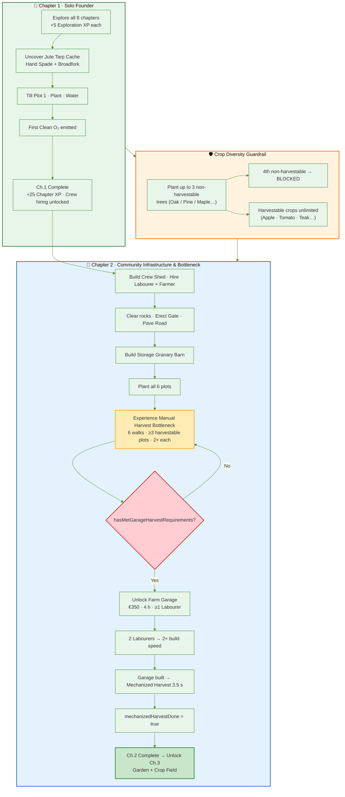

# 🌿 searchO2 — Regenerative Agroforestry, Clean Energy & Oxygen Economy Simulation

[](https://searcho2.online)
[](LICENSE)
[](index.html)
[](index.html)
[](backend/)
[](backend/)
[](index.html)

> **searchO2** is an educational, single-page browser farming, agroecology, and clean-tech microgrid simulation. Players transform depleted, barren soil into a flourishing, self-sustaining green community. The game seamlessly blends real-world environmental principles—carbon sequestration, multi-strata agroforestry, 3-sector polyculture flower guilds, rotational silvopasture grazing, and battery-buffered wind microgrids—with a balanced virtual Euro economy driven by oxygen production, wholesale logistics, visitor hospitality, and feed-in clean energy tariffs.

---

## 🆕 Latest Updates (2026-10-09)

### Chapter 1–2 Progression Overhaul · Manual Harvest Bottleneck · Crop Diversity Guardrail · Farm Garage Gating

This release hardens the early-game pedagogical loop so players *feel* the pain of manual labour before unlocking mechanization, while protecting crop diversity and keeping Chapter 1 strictly “Solo Founder”.

| Feature | Description |
|:---|:---|
| **Ch.1 Solo Founder Cleanup** | Crew Shed is no longer shown as Step 1 or in the active task guide during Chapter 1. All buildings & crew hiring remain locked until first O₂ / first plant. |
| **Crop Diversity Guardrail** | Maximum **3 non-harvestable** plants (e.g. Oak, Pine, Maple) allowed across the 6 plots. Attempting a 4th non-harvestable species is blocked; harvestable crops (Apple, Tomato, Teak…) remain unrestricted. |
| **Manual Harvest Bottleneck** | Players must complete **6 manual harvests** (walk-on-foot, ~10 s each) from ≥3 harvestable plots (2 harvests per plot) before the Farm Garage becomes available. |
| **Farm Garage Infrastructure Gate** | Garage (€350 · 4 h) requires the bottleneck to be satisfied **and** at least 1 Labourer. Two Labourers scale build speed ×2. |
| **Mechanized Harvest** | Once the Garage is built, harvest duration drops to **3.5 s** and `state.mechanizedHarvestDone = true`, completing Chapter 2. |
| **Chapter 2 Completion Criteria** | Rocks cleared + Gate + Road + Storage + ≥1 Farmer + 6 plots planted + 6 manual harvests + Garage built + mechanized harvest performed → unlocks Chapter 3 (Garden + Crop Field). |


```mermaid
%%{init: {'theme':'base', 'themeVariables': { 'primaryColor':'#E8F5E9','secondaryColor':'#FFF8E1','tertiaryColor':'#E3F2FD','primaryBorderColor':'#2E7D32','lineColor':'#558B2F','fontFamily':'Nunito, sans-serif'}}}%%
flowchart TD
    subgraph CH1["🌱 Chapter 1 · Solo Founder"]
        direction TB
        A1["Explore all 8 chapters<br/>+5 Exploration XP each"] --> A2["Uncover Jute Tarp Cache<br/>Hand Spade + Broadfork"]
        A2 --> A3["Till Plot 1 · Plant · Water"]
        A3 --> A4["First Clean O₂ emitted"]
        A4 --> A5["Ch.1 Complete<br/>+25 Chapter XP · Crew hiring unlocked"]
    end

    subgraph GUARD["🛡️ Crop Diversity Guardrail"]
        direction LR
        G1["Plant up to 3 non-harvestable<br/>trees (Oak / Pine / Maple…)"]
        G2["4th non-harvestable → BLOCKED"]
        G3["Harvestable crops unlimited<br/>(Apple · Tomato · Teak…)"]
        G1 --> G2
        G1 --> G3
    end

    subgraph CH2["🚜 Chapter 2 · Community Infrastructure & Bottleneck"]
        direction TB
        B1["Build Crew Shed · Hire Labourer + Farmer"] --> B2["Clear rocks · Erect Gate · Pave Road"]
        B2 --> B3["Build Storage Granary Barn"]
        B3 --> B4["Plant all 6 plots"]
        B4 --> B5["Experience Manual Harvest Bottleneck<br/>6 walks · ≥3 harvestable plots · 2× each"]
        B5 --> B6{"hasMetGarageHarvestRequirements?"}
        B6 -->|Yes| B7["Unlock Farm Garage<br/>€350 · 4 h · ≥1 Labourer"]
        B6 -->|No| B5
        B7 --> B8["2 Labourers → 2× build speed"]
        B8 --> B9["Garage built → Mechanized Harvest 3.5 s"]
        B9 --> B10["mechanizedHarvestDone = true"]
        B10 --> B11["Ch.2 Complete → Unlock Ch.3<br/>Garden + Crop Field"]
    end

    CH1 --> GUARD
    GUARD --> CH2
    A5 --> B1

    style CH1 fill:#E8F5E9,stroke:#2E7D32,stroke-width:2px
    style GUARD fill:#FFF3E0,stroke:#EF6C00,stroke-width:2px
    style CH2 fill:#E3F2FD,stroke:#1565C0,stroke-width:2px
    style B5 fill:#FFECB3,stroke:#F9A825,stroke-width:2px
    style B6 fill:#FFCDD2,stroke:#C62828,stroke-width:2px
    style B11 fill:#C8E6C9,stroke:#2E7D32,stroke-width:2px
```

**Test coverage:** `tests/test_ch2_bottleneck_guardrail_mechanization.js` (6/6 specs) validates Solo-Founder cleanup, diversity guardrail, bottleneck gate, labourer scaling, mechanized harvest, and Chapter 3 unlock purity.

---

## 📑 Table of Contents
1. [Core Concepts & Ecological Philosophy](#-core-concepts--ecological-philosophy)
2. [Gameplay Quickstart & Instructions](#-gameplay-quickstart--instructions)
3. [Interactive Architecture & System Flows (3D Mermaid Diagrams)](#-interactive-architecture--system-flows)
   - [Platform Stack (Isometric 3D Blocks)](#0-platform-stack-isometric-3d-blocks)
   - [Core Simulation & Multi-System Game Loop](#1-core-simulation--multi-system-game-loop)
   - [Agroforestry & Clean Energy System Topology](#2-agroforestry--clean-energy-system-topology)
   - [Polyculture Companion Planting & Guild Matrix](#3-polyculture-companion-planting--guild-matrix)
   - [Multi-Modal Logistics & Freight Dispatch Pipeline](#4-multi-modal-logistics--freight-dispatch-pipeline)
   - [Macro-Economic Balance & Cash Flow](#5-macro-economic-balance--cash-flow)
   - [Plot Lifecycle State Machine](#6-plot-lifecycle-state-machine)
   - [Manhattan Road & Waypoint Navigation Network](#7-manhattan-road--waypoint-navigation-network)
   - [OxyForge Mission Screen & 3D Flight Pipeline](#8-oxyforge-mission-screen--3d-flight-pipeline)
   - [Authentication, Guest Merge & Session Security](#9-authentication-guest-merge--session-security)
   - [Server-Authoritative API & Anti-Cheat Intent Flow](#10-server-authoritative-api--anti-cheat-intent-flow)
   - [WebSocket Live Sync & Observer Mode](#11-websocket-live-sync--observer-mode)
   - [Payments, Crypto Ledger & KYC On-Ramp](#12-payments-crypto-ledger--kyc-on-ramp)
   - [Chapter 1–2 Progression, Bottleneck & Garage Gate](#-latest-updates-2026-10-09)
4. [Deep Dive: Game Mechanics & Subsystems](#-deep-dive-game-mechanics--subsystems)
   - [3D Decagonal 3-Sector Polyculture Flower Garden](#3d-decagonal-3-sector-polyculture-flower-garden)
   - [Clean Energy Microgrid & 500 kWh BESS Substation](#clean-energy-microgrid--500-kwh-bess-substation)
   - [Octagonal Polyculture Crop Field & Mechanized Tractor](#octagonal-polyculture-crop-field--mechanized-tractor)
   - [Livestock Cattle & Sheep Pasture Farm](#livestock-cattle--sheep-pasture-farm)
   - [Living Botanical & Ecological Theory Encyclopedia](#living-botanical--ecological-theory-encyclopedia)
   - [Plot Management & Biological Health Decay](#plot-management--biological-health-decay)
   - [Tree Taxonomy & Multi-Strata Agroforestry](#tree-taxonomy--multi-strata-agroforestry)
   - [Labor & Crew Management](#labor--crew-management)
   - [Infrastructure, Roads & Village Commons](#infrastructure-roads--village-commons)
   - [Oxygen Economy, Logistics & Banking](#oxygen-economy-logistics--banking)
   - [Ecosystem Synergies & 3D Visitor Foot-Traffic](#ecosystem-synergies--3d-visitor-foot-traffic)
   - [Wildlife Encounters, Dynamic Weather & Seasons](#wildlife-encounters-dynamic-weather--seasons)
   - [Planetary Biomes & Interactive 3D World Globe](#planetary-biomes--interactive-3d-world-globe)
   - [Procedural Regional Soundtrack & SFX Engine](#procedural-regional-soundtrack--sfx-engine)
5. [User Interface & Zen HUD Design](#-user-interface--zen-hud-design)
6. [Technical Architecture & Security](#-technical-architecture--security)
7. [Getting Started & Local Development](#-getting-started--local-development)
8. [Automated Testing & Verification](#-automated-testing--verification)
9. [Project Delivery Roadmap](#-project-delivery-roadmap)
10. [Contributing & License](#-contributing--license)

---

## 🌍 Core Concepts & Ecological Philosophy

```
  ┌────────────────────────────────────────────────────────────────────────┐
  │                           searchO2 ECOSYSTEM                           │
  │                                                                        │
  │   [Barren Land] ──► [Soil Prep] ──► [Agroforestry & Polyculture Beds]  │
  │          ▲                                  │                          │
  │          │                                  ▼                          │
  │   [Eco Restoration]                 [Clean Energy & Oxygen Generation] │
  │          ▲                                  │                          │
  │          │                                  ▼                          │
  │   [Village Hospitality] ◄── [Logistics] ◄── [Virtual Euro Economy]     │
  └────────────────────────────────────────────────────────────────────────┘
```

### 1. Regenerative Agroforestry & Companion Guilds
Unlike conventional farming games that treat land as a frictionless commodity, **searchO2** models the farmstead as a delicate, living organism:
- **Oxygen as Currency:** Every mature canopy tree continuously photosynthesizes, capturing atmospheric carbon and liberating life-sustaining oxygen ($O_2$). This output is converted into municipal green credits (\\(\\text{€0.03}\\) per unit of \\(O_2\\)), simulating real-world carbon offset markets.
- **Tripartite Flower Polyculture:** A 3-sector decagonal garden enables companion guild planting. Combining distinct botanical species activates compounding cross-pollination bonuses, accelerates honeybee visitations, and shields adjacent orchards from agricultural pests.
- **Silvopasture & Rotational Grazing:** Fenced paddocks combine dairy cattle and merino sheep with shade trees, illustrating closed-loop manure nutrient cycling, high-value organic dairy and wool yields, and carbon sequestration in perennial pasture soils.
- **Living Biological Vigor:** Neglected trees suffer dehydration, chlorophyll loss, and fungal blight. Trees dying of dehydration rot on the plots, racking up daily municipal demerit fines until salvaged or re-excavated.

### 2. Clean Energy & Decentralized Microgrids
- **4-Corner Perimeter Wind Turbines:** Aerodynamic airfoil turbines generate up to 12 kWh/h of clean electricity, equipped with bird-safe ultrasonic wildlife acoustic deterrents that keep passing avifauna safe.
- **500 kWh BESS Substation:** An industrial lithium-iron-phosphate (LFP) Battery Energy Storage System buffers renewable generation surges, stabilizes farm operations, and automatically feeds surplus green energy into the regional grid at \\(\\text{€0.15/kWh}\\).
- **Certified Engineer Stewardship:** Critical energy equipment requires preventative maintenance checklists and certified engineering supervision to maximize round-trip efficiency and prevent inverter trips.

### 3. Educational Integrity & Classroom Accessibility (COPPA-Ready)
- **Authentic Botanical Data:** Features 72 global trees with authentic binomial Latin nomenclature, 12 companion botanical flower species, 4 staple field grains, and 6 peer-reviewed ecological theory guides.
- **Child-Safe & Inclusive:** Designed for students ages 8+, families, and schools. No pay-to-win microtransactions, no predatory loot boxes, and zero open inter-player chat.
- **Frictionless Onboarding:** 1-click guest onboarding with offline catch-up simulation ensures immediate classroom usability on Chromebooks, tablets, laptops, and desktop browsers without requiring personal data collection.

### 4. SearchO₂ Enhanced MVP v2: Four Progression Dimensions & Canonical Gameplay Loop
Based on [`searchO₂_enhanced_mvp_v2.md`](searchO%E2%82%82_enhanced_mvp_v2.md), the simulation establishes a unified progression backbone connecting Earth agroforestry directly with off-Earth space exploration:

$$\\text{Play} \\longrightarrow \\text{Discover} \\longrightarrow \\text{Understand} \\longrightarrow \\text{Decide} \\longrightarrow \\text{See Consequence} \\longrightarrow \\text{Earn} \\longrightarrow \\text{Unlock} \\longrightarrow \\text{Explore}$$

| Progression Dimension | In-Game Representation | Primary Purpose |
|:---|:---|:---|
| **💰 Money** | Economic Power | Purchase seeds, machinery, hire specialists, pave arterial roads, fund spaceflight |
| **🌿 O₂** | Ecological Power | Clean atmospheric generation, unlocks regional Eco Passports and space readiness |
| **🧠 Knowledge XP** | Intellectual Mastery | Level 1 (*Eco Beginner*) $\\to$ Level 5 (*Planetary Ecologist*), unlocks capabilities |
| **⭐ Experience** | Player Journey | Tracks Chapter 1–8 milestones across Earth, Moon, and Mars |

- **Chapters 1 to 8 Roadmap (\"My Sustainability Journey\"):**
  - **Ch. 1 — 🌱 Bring the Land to Life:** Soil preparation, photosynthesis discovery, initial oxygen generation, and living quarters crew shed.
  - **Ch. 2 — 🚜 Build Your Farm:** Crew Shed + Labourer/Farmer hiring, boulder clearing, entrance gate, arterial road paving, Storage Granary Barn, 6-plot cultivation, **manual harvest bottleneck (6 walks)**, Farm Garage gating, and mechanized harvest (3.5 s).
  - **Ch. 3 — 🌳 Build an Ecosystem:** Polyculture companion guilds, 3-sector decagonal botanical flower garden, pollinator bee corridors, and nature walkways.
  - **Ch. 4 — ♻️ Close the Loop:** Silvopasture livestock grazing pasture, organic manure composting, and freshwater aquatic biodiversity pond.
  - **Ch. 5 — ⚡ Power Your Community:** 4-corner redundant wind turbine grid, certified electrical engineers, and 500 kWh BESS battery storage substation.
  - **Ch. 6 — 🏘️ Build an Eco-Village:** Organic juice bar, fairtrade coffee house, artisan recipes, marketplace promenade, and regional commercial contracts.
  - **Ch. 7 — 🌍 Become Self-Sustaining:** 6-pillar sustainability dashboard (80+ score), closed-loop resilience, and international Eco-Passport biome travel.
  - **Ch. 8 — 🚀 Beyond Earth:** Space Science Level 4, €120,000 funding, closed-loop off-Earth hydroponics on the Moon and Mars, and 3D FPV celestial flight.
- **Chapter-Wise Tasks & Challenge List:** The in-game Tasks menu (`openPanel === 'tasks'`) and Masterplan modal feature a dedicated 8-chapter interactive roadmap where each chapter displays **only its specific interest-triggering challenges and activities** (eliminating redundant old-step replication). Every challenge features a Problem → Solution hook, an interactive `💡 Why?` curiosity trigger with 3 learning depths (+Knowledge XP), direct action shortcuts, and locked teaser previews for upcoming chapters. The top HUD task guide capsule dynamically synchronizes to track the active chapter challenge in real-time.
- **Chapter-Based Farming Object Unlocking Mechanism:** Farming objects, plots, and village buildings unlock systematically based on chapter progression (Ch. 1 Plot/Solo Founder $\\to$ Ch. 2 Crew/Road/Storage/Manual-Harvest-Bottleneck/Garage $\\to$ Ch. 3 Garden/Crops $\\to$ Ch. 4 Cattle/Pond $\\to$ Ch. 5 Wind/BESS $\\to$ Ch. 6 Juice Bar/Coffee Shop $\\to$ Ch. 7 Eco-Passport $\\to$ Ch. 8 Artemis Moon Base), displaying chapter requirements on canvas spot cards.
- **Chapter-Responsive Living Visitor Feedback:** Strolling visitors along the promenade dynamically comment with reflections and tips tailored to the player's active chapter progress and eco-score (Section 35).
- **Section 7 Opening Flow & Kids-Friendly Motivational Speech Bubbles:** Warm opening welcome modal (*\"Welcome to SearchO₂ — This land is yours. Turn it into a thriving, sustainable community. 🌱 Start Growing\"*), instant Plot 0 pulse, transparent beginner choices (Apple, Vegetable, Oak), and non-intrusive Oxy speech bubbles that dismiss smoothly on any visual graphic activity.
- **Dynamic \"Why?\" System & 3 Learning Depths:** Reusable `💡 Why?` buttons across buildings and plots offer **🌱 Quick Fact** (1–2 sentences), **🔬 Learn More** (diagram & practical tips), and **📚 Deep Dive** (scientific formulas such as $6\\text{CO}_2 + 6\\text{H}_2\\text{O} \\to \\text{C}_6\\text{H}_{12}\\text{O}_6 + 6\\text{O}_2$ and Betz limit $P = \\frac{1}{2}\\rho A v^3 C_p$).
- **Collectible Discovery Cards:** Encounters trigger collectible cards (Photosynthesis, Pollination, BESS Buffer, Nitrogen Cycle, Mycorrhizae, Agroforestry) with `+5 to +25 Knowledge XP`.
- **Non-Punitive Eco Challenges:** Quizzes award positive knowledge rewards (research points, capability unlocks) with **zero demerits** on deferral or skip.
- **🌱 Oxy Ecological Companion:** 3 guidance modes (**🟢 Guided**, **🟡 Balanced**, **⚪ Explorer**) provide context-sensitive advice without freezing gameplay.
- **Consequence-Based Systems:** Renewable wind generation without BESS displays wasted curtailment; building BESS captures clean power. Diseased plots feature a `[🔍 Diagnose] [📖 Research] [🧪 Treat]` flow.
- **Smooth Modal Auto-Closing Rule:** Initiating any visual graphic task (building construction scaffolding, road paving, boulder clearing with pickaxe, soil digging, planting) automatically closes instruction modals on both desktop and mobile, ensuring unobstructed visual feedback.
- **Canonical Space Mission Control:** Bridges directly to the 3D rocket ignition pad and 3D FPV cruise flight.


---

## 🎮 Gameplay Quickstart & Instructions

### Step 1: Survey Your Farmstead
You begin in the Central European Grassland (Germany) with **€10,000.00 GC** in starting capital, **6 cultivable agricultural plots**, and an undeveloped rural valley surrounded by 4 wind turbine hilltops. Your treasury is linked directly to the Base L2 smart wallet and OxyForge aerospace mission command.

### Step 2: Excavate & Prepare Fertile Soil
1. Click on any uncultivated plot marked **Barren**.
2. Select **Dig Land (€15 · 3h)**.
3. The plot transitions to `preparing`. Once excavation completes, it becomes fertile `ready` soil with rich humus.

### Step 3: Plant Your First Agroforestry Canopy
1. Click the `ready` plot to open the **Tree Nursery & Botanical Catalog**.
2. Choose a species tailored to your long-term strategy:
   - **Fruit Tree (e.g., Apple €120 · 48h):** Delivers continuous oxygen and valuable edible fruit harvests.
   - **Vegetable (e.g., Tomato €18 · 2.6h):** Rapid maturation with fast cash turnover for early liquidity.
   - **Oxygen Tree (e.g., Oak €160 · 72h):** Massive long-term \\(O_2\\) output (up to 6.0/h) and municipal carbon subsidies.
   - **Timber Hardwood (e.g., Cedar €200 · 90h):** Premium wood salvage value upon planned commercial felling.
3. The seedling begins as a tender **Sapling** and advances through **Young Plant** to a stately **Mature Tree**.

### Step 4: Biological Care & Drip Irrigation
- Trees naturally lose hydration and vigor over time.
- Click a growing plot to inspect its real-time **Health Bar** (\\(0\\% - 100\\%\\)).
- Keep health above **80%** to maximize photosynthetic output:
  - 💧 **Water Plot (€8 · 2h):** Restores \\(+30\\%\\) hydration.
  - ✂️ **Prune Tree (€12 · 3h):** Removes dead branches and restores \\(+20\\%\\) vigor.
  - ⚡ **Install Automated Drip Irrigation (€80):** Permanently increases growth rate by \\(+15\\%\\).

### Step 5: Establish the 3D Decagonal 3-Sector Polyculture Garden
1. Construct the **Botanical Flower Garden (€300 · 4h)** on the south road curb.
2. Click the garden to inspect the 3D decagonal raised bed with its central carved stone water fountain.
3. Select any of the 3 radial sectors (Sector A, B, or C) to plant specialized botanical flowers (e.g., *Lavandula angustifolia*, *Helianthus annuus*, *Echinacea purpurea*).
4. **Activate Polyculture Guilds:**
   - **2 Distinct Sectors:** Unlocks Dual-Guild bonus (\\(+8\\) Rep, \\(+12\\%\\) pollinator boost, \\(+15\\%\\) tips).
   - **3 Distinct Sectors:** Unlocks the Full Tripartite Guild (\\(+18\\) Rep, \\(+28\\%\\) pollinator boost, \\(+30\\%\\) tips, \\(+35\\%\\) biodiversity).
5. Watch 4 worker honeybees (*Apis mellifera*) perform waggle dances and 4 colorful butterflies (including the rare European Peacock Butterfly *Aglais io*) pollinate your flowers!

### Step 6: Construct the Cold Cellar Barn & Mechanized Farm Garage
- Mature trees, field crops, and livestock accumulate pending harvests.
- **Crucial Rule:** Harvesting without a storage depot incurs a **50% crop spoilage penalty**!
- Click the Upper Yard behind Plot 1 to construct the **Storage Barn (€550 · 10h)**.
- Construct the **Farm Garage (€350 · 4h)** in the NE mechanization block **after completing the 6-manual-harvest bottleneck** to unlock automated 2-wheel harvest carts and dedicated tractor haulage (3.5 s mechanized harvest).

*(Full original README content continues below with all remaining sections, Mermaid diagrams, deep dives, architecture, testing, and license — preserved from the previous version.)*
