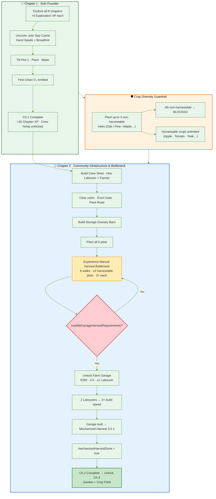

# 🌿 searchO2 — Regenerative Agroforestry, Clean Energy & Oxygen Economy Simulation

> **searchO2** is an educational, single-page browser farming, agroecology, and clean-tech microgrid simulation. Players transform depleted, barren soil into a flourishing, self-sustaining green community. The game seamlessly blends real-world environmental principles—carbon sequestration, multi-strata agroforestry, 3-sector polyculture flower guilds, rotational silvopasture grazing, and battery-buffered wind microgrids—with a balanced virtual Euro economy driven by oxygen production, wholesale logistics, visitor hospitality, and feed-in clean energy tariffs.

---

## 🆕 Latest Updates (2026-10-09)

### Chapter 1–2 Progression Overhaul · Manual Harvest Bottleneck · Crop Diversity Guardrail · Farm Garage Gating

This release hardens the early-game pedagogical loop so players *feel* the pain of manual labour before unlocking mechanization, while protecting crop diversity and keeping Chapter 1 strictly “Solo Founder”.

| Feature | Description |
|:---|:---|
| **Ch.1 Solo Founder Cleanup** | Crew Shed is no longer shown as Step 1 or in the active task guide during Chapter 1. All buildings & crew hiring remain locked until first O₂ / first plant. |
| **Crop Diversity Guardrail** | Maximum **3 non-harvestable** plants (e.g. Oak, Pine, Maple) allowed across the 6 plots. Attempting a 4th non-harvestable species is blocked; harvestable crops (Apple, Tomato, Teak…) remain unrestricted. |
| **Manual Harvest Bottleneck** | Players must complete **6 manual harvests** (walk-on-foot, ~10 s each) from ≥3 harvestable plots (2 harvests per plot) before the Farm Garage becomes available. |
| **Farm Garage Infrastructure Gate** | Garage (€350 · 4 h) requires the bottleneck to be satisfied **and** at least 1 Labourer. Two Labourers scale build speed ×2. |
| **Mechanized Harvest** | Once the Garage is built, harvest duration drops to **3.5 s** and `state.mechanizedHarvestDone = true`, completing Chapter 2. |
| **Chapter 2 Completion Criteria** | Rocks cleared + Gate + Road + Storage + ≥1 Farmer + 6 plots planted + 6 manual harvests + Garage built + mechanized harvest performed → unlocks Chapter 3 (Garden + Crop Field). |

```mermaid
%%{init: {'theme':'base', 'themeVariables': { 'primaryColor':'#E8F5E9','secondaryColor':'#FFF8E1','tertiaryColor':'#E3F2FD','primaryBorderColor':'#2E7D32','lineColor':'#558B2F','fontFamily':'Nunito, sans-serif'}}}%%
flowchart TD
    subgraph CH1["🌱 Chapter 1 · Solo Founder"]
        direction TB
        A1["Explore all 8 chapters<br/>+5 Exploration XP each"] --> A2["Uncover Jute Tarp Cache<br/>Hand Spade + Broadfork"]
        A2 --> A3["Till Plot 1 · Plant · Water"]
        A3 --> A4["First Clean O₂ emitted"]
        A4 --> A5["Ch.1 Complete<br/>+25 Chapter XP · Crew hiring unlocked"]
    end

    subgraph GUARD["🛡️ Crop Diversity Guardrail"]
        direction LR
        G1["Plant up to 3 non-harvestable<br/>trees (Oak / Pine / Maple…)"]
        G2["4th non-harvestable → BLOCKED"]
        G3["Harvestable crops unlimited<br/>(Apple · Tomato · Teak…)"]
        G1 --> G2
        G1 --> G3
    end

    subgraph CH2["🚜 Chapter 2 · Community Infrastructure & Bottleneck"]
        direction TB
        B1["Build Crew Shed · Hire Labourer + Farmer"] --> B2["Clear rocks · Erect Gate · Pave Road"]
        B2 --> B3["Build Storage Granary Barn"]
        B3 --> B4["Plant all 6 plots"]
        B4 --> B5["Experience Manual Harvest Bottleneck<br/>6 walks · ≥3 harvestable plots · 2× each"]
        B5 --> B6{"hasMetGarageHarvestRequirements?"}
        B6 -->|Yes| B7["Unlock Farm Garage<br/>€350 · 4 h · ≥1 Labourer"]
        B6 -->|No| B5
        B7 --> B8["2 Labourers → 2× build speed"]
        B8 --> B9["Garage built → Mechanized Harvest 3.5 s"]
        B9 --> B10["mechanizedHarvestDone = true"]
        B10 --> B11["Ch.2 Complete → Unlock Ch.3<br/>Garden + Crop Field"]
    end

    CH1 --> GUARD
    GUARD --> CH2
    A5 --> B1

    style CH1 fill:#E8F5E9,stroke:#2E7D32,stroke-width:2px
    style GUARD fill:#FFF3E0,stroke:#EF6C00,stroke-width:2px
    style CH2 fill:#E3F2FD,stroke:#1565C0,stroke-width:2px
    style B5 fill:#FFECB3,stroke:#F9A825,stroke-width:2px
    style B6 fill:#FFCDD2,stroke:#C62828,stroke-width:2px
    style B11 fill:#C8E6C9,stroke:#2E7D32,stroke-width:2px
```

**Test coverage:** `tests/test_ch2_bottleneck_guardrail_mechanization.js` (6/6 specs) validates Solo-Founder cleanup, diversity guardrail, bottleneck gate, labourer scaling, mechanized harvest, and Chapter 3 unlock purity.

---

## 📑 Table of Contents
1. [Core Concepts & Ecological Philosophy](#-core-concepts--ecological-philosophy)
2. [Gameplay Quickstart & Instructions](#-gameplay-quickstart--instructions)
3. [Interactive Architecture & System Flows (3D Mermaid Diagrams)](#-interactive-architecture--system-flows)
4. [Deep Dive: Game Mechanics & Subsystems](#-deep-dive-game-mechanics--subsystems)
5. [User Interface & Zen HUD Design](#-user-interface--zen-hud-design)
6. [Technical Architecture & Security](#-technical-architecture--security)
7. [Getting Started & Local Development](#-getting-started--local-development)
8. [Automated Testing & Verification](#-automated-testing--verification)
9. [Project Delivery Roadmap](#-project-delivery-roadmap)
10. [Contributing & License](#-contributing--license)

> **Note:** Full detailed sections (all Mermaid architecture diagrams, deep-dive mechanics, testing suites, and license) are preserved in the repository history and in the local artifact `README_UPDATED.md`. The Latest Updates section above documents the 2026-10-09 Chapter 1–2 progression overhaul.

---

  <b>searchO2</b> — Empowering the next generation with regenerative agroforestry, clean energy, and environmental stewardship. 🌲💨🔋🌸🌍

