# 🌿 searchO2 — Regenerative Agroforestry, Clean Energy & Oxygen Economy Simulation

[](https://searcho2.online)
[](LICENSE)
[](index.html)
[](index.html)
[](backend/)
[](backend/)
[](index.html)

> **searchO2** is an educational, single-page browser farming, agroecology, and clean-tech microgrid simulation. Players transform depleted, barren soil into a flourishing, self-sustaining green community. The game seamlessly blends real-world environmental principles—carbon sequestration, multi-strata agroforestry, 3-sector polyculture flower guilds, rotational silvopasture grazing, and battery-buffered wind microgrids—with a balanced virtual Euro economy driven by oxygen production, wholesale logistics, visitor hospitality, and feed-in clean energy tariffs.

---

## 📑 Table of Contents
1. [Core Concepts & Ecological Philosophy](#-core-concepts--ecological-philosophy)
2. [Gameplay Quickstart & Instructions](#-gameplay-quickstart--instructions)
3. [Interactive Architecture & System Flows (3D Mermaid Diagrams)](#-interactive-architecture--system-flows)
   - [Platform Stack (Isometric 3D Blocks)](#0-platform-stack-isometric-3d-blocks)
   - [Core Simulation & Multi-System Game Loop](#1-core-simulation--multi-system-game-loop)
   - [Agroforestry & Clean Energy System Topology](#2-agroforestry--clean-energy-system-topology)
   - [Polyculture Companion Planting & Guild Matrix](#3-polyculture-companion-planting--guild-matrix)
   - [Multi-Modal Logistics & Freight Dispatch Pipeline](#4-multi-modal-logistics--freight-dispatch-pipeline)
   - [Macro-Economic Balance & Cash Flow](#5-macro-economic-balance--cash-flow)
   - [Plot Lifecycle State Machine](#6-plot-lifecycle-state-machine)
   - [Manhattan Road & Waypoint Navigation Network](#7-manhattan-road--waypoint-navigation-network)
   - [OxyForge Mission Screen & 3D Flight Pipeline](#8-oxyforge-mission-screen--3d-flight-pipeline)
   - [Authentication, Guest Merge & Session Security](#9-authentication-guest-merge--session-security)
   - [Server-Authoritative API & Anti-Cheat Intent Flow](#10-server-authoritative-api--anti-cheat-intent-flow)
   - [WebSocket Live Sync & Observer Mode](#11-websocket-live-sync--observer-mode)
   - [Payments, Crypto Ledger & KYC On-Ramp](#12-payments-crypto-ledger--kyc-on-ramp)
4. [Deep Dive: Game Mechanics & Subsystems](#-deep-dive-game-mechanics--subsystems)
   - [3D Decagonal 3-Sector Polyculture Flower Garden](#3d-decagonal-3-sector-polyculture-flower-garden)
   - [Clean Energy Microgrid & 500 kWh BESS Substation](#clean-energy-microgrid--500-kwh-bess-substation)
   - [Octagonal Polyculture Crop Field & Mechanized Tractor](#octagonal-polyculture-crop-field--mechanized-tractor)
   - [Livestock Cattle & Sheep Pasture Farm](#livestock-cattle--sheep-pasture-farm)
   - [Living Botanical & Ecological Theory Encyclopedia](#living-botanical--ecological-theory-encyclopedia)
   - [Plot Management & Biological Health Decay](#plot-management--biological-health-decay)
   - [Tree Taxonomy & Multi-Strata Agroforestry](#tree-taxonomy--multi-strata-agroforestry)
   - [Labor & Crew Management](#labor--crew-management)
   - [Infrastructure, Roads & Village Commons](#infrastructure-roads--village-commons)
   - [Oxygen Economy, Logistics & Banking](#oxygen-economy-logistics--banking)
   - [Ecosystem Synergies & 3D Visitor Foot-Traffic](#ecosystem-synergies--3d-visitor-foot-traffic)
   - [Wildlife Encounters, Dynamic Weather & Seasons](#wildlife-encounters-dynamic-weather--seasons)
   - [Planetary Biomes & Interactive 3D World Globe](#planetary-biomes--interactive-3d-world-globe)
   - [Procedural Regional Soundtrack & SFX Engine](#procedural-regional-soundtrack--sfx-engine)
5. [User Interface & Zen HUD Design](#-user-interface--zen-hud-design)
6. [Technical Architecture & Security](#-technical-architecture--security)
7. [Getting Started & Local Development](#-getting-started--local-development)
8. [Automated Testing & Verification](#-automated-testing--verification)
9. [Project Delivery Roadmap](#-project-delivery-roadmap)
10. [Contributing & License](#-contributing--license)

---

## 🌍 Core Concepts & Ecological Philosophy

```
  ┌────────────────────────────────────────────────────────────────────────┐
  │                           searchO2 ECOSYSTEM                           │
  │                                                                        │
  │   [Barren Land] ──► [Soil Prep] ──► [Agroforestry & Polyculture Beds]  │
  │          ▲                                  │                          │
  │          │                                  ▼                          │
  │   [Eco Restoration]                 [Clean Energy & Oxygen Generation] │
  │          ▲                                  │                          │
  │          │                                  ▼                          │
  │   [Village Hospitality] ◄── [Logistics] ◄── [Virtual Euro Economy]     │
  └────────────────────────────────────────────────────────────────────────┘
```

### 1. Regenerative Agroforestry & Companion Guilds
Unlike conventional farming games that treat land as a frictionless commodity, **searchO2** models the farmstead as a delicate, living organism:
- **Oxygen as Currency:** Every mature canopy tree continuously photosynthesizes, capturing atmospheric carbon and liberating life-sustaining oxygen ($O_2$). This output is converted into municipal green credits (\(\text{€0.03}\) per unit of \(O_2\)), simulating real-world carbon offset markets.
- **Tripartite Flower Polyculture:** A 3-sector decagonal garden enables companion guild planting. Combining distinct botanical species activates compounding cross-pollination bonuses, accelerates honeybee visitations, and shields adjacent orchards from agricultural pests.
- **Silvopasture & Rotational Grazing:** Fenced paddocks combine dairy cattle and merino sheep with shade trees, illustrating closed-loop manure nutrient cycling, high-value organic dairy and wool yields, and carbon sequestration in perennial pasture soils.
- **Living Biological Vigor:** Neglected trees suffer dehydration, chlorophyll loss, and fungal blight. Trees dying of dehydration rot on the plots, racking up daily municipal demerit fines until salvaged or re-excavated.

### 2. Clean Energy & Decentralized Microgrids
- **4-Corner Perimeter Wind Turbines:** Aerodynamic airfoil turbines generate up to 12 kWh/h of clean electricity, equipped with bird-safe ultrasonic wildlife acoustic deterrents that keep passing avifauna safe.
- **500 kWh BESS Substation:** An industrial lithium-iron-phosphate (LFP) Battery Energy Storage System buffers renewable generation surges, stabilizes farm operations, and automatically feeds surplus green energy into the regional grid at \(\text{€0.15/kWh}\).
- **Certified Engineer Stewardship:** Critical energy equipment requires preventative maintenance checklists and certified engineering supervision to maximize round-trip efficiency and prevent inverter trips.

### 3. Educational Integrity & Classroom Accessibility (COPPA-Ready)
- **Authentic Botanical Data:** Features 72 global trees with authentic binomial Latin nomenclature, 12 companion botanical flower species, 4 staple field grains, and 6 peer-reviewed ecological theory guides.
- **Child-Safe & Inclusive:** Designed for students ages 8+, families, and schools. No pay-to-win microtransactions, no predatory loot boxes, and zero open inter-player chat.
- **Frictionless Onboarding:** 1-click guest onboarding with offline catch-up simulation ensures immediate classroom usability on Chromebooks, tablets, laptops, and desktop browsers without requiring personal data collection.

### 4. SearchO₂ Enhanced MVP v2: Four Progression Dimensions & Canonical Gameplay Loop
Based on [`searchO₂_enhanced_mvp_v2.md`](searchO%E2%82%82_enhanced_mvp_v2.md), the simulation establishes a unified progression backbone connecting Earth agroforestry directly with off-Earth space exploration:

$$\text{Play} \longrightarrow \text{Discover} \longrightarrow \text{Understand} \longrightarrow \text{Decide} \longrightarrow \text{See Consequence} \longrightarrow \text{Earn} \longrightarrow \text{Unlock} \longrightarrow \text{Explore}$$

| Progression Dimension | In-Game Representation | Primary Purpose |
|:---|:---|:---|
| **💰 Money** | Economic Power | Purchase seeds, machinery, hire specialists, pave arterial roads, fund spaceflight |
| **🌿 O₂** | Ecological Power | Clean atmospheric generation, unlocks regional Eco Passports and space readiness |
| **🧠 Knowledge XP** | Intellectual Mastery | Level 1 (*Eco Beginner*) $\to$ Level 5 (*Planetary Ecologist*), unlocks capabilities |
| **⭐ Experience** | Player Journey | Tracks Chapter 1–8 milestones across Earth, Moon, and Mars |

- **Chapters 1 to 8 Roadmap ("My Sustainability Journey"):**
  - **Ch. 1 — 🌱 Bring the Land to Life:** Soil preparation, photosynthesis discovery, initial oxygen generation, and living quarters crew shed.
  - **Ch. 2 — 🚜 Build Your Farm:** Storage Granary Barn rot prevention, arterial highway paving, feeder subways, farm machinery garage, and workforce recruitment.
  - **Ch. 3 — 🌳 Build an Ecosystem:** Polyculture companion guilds, 3-sector decagonal botanical flower garden, pollinator bee corridors, and nature walkways.
  - **Ch. 4 — ♻️ Close the Loop:** Silvopasture livestock grazing pasture, organic manure composting, and freshwater aquatic biodiversity pond.
  - **Ch. 5 — ⚡ Power Your Community:** 4-corner redundant wind turbine grid, certified electrical engineers, and 500 kWh BESS battery storage substation.
  - **Ch. 6 — 🏘️ Build an Eco-Village:** Organic juice bar, fairtrade coffee house, artisan recipes, marketplace promenade, and regional commercial contracts.
  - **Ch. 7 — 🌍 Become Self-Sustaining:** 6-pillar sustainability dashboard (80+ score), closed-loop resilience, and international Eco-Passport biome travel.
  - **Ch. 8 — 🚀 Beyond Earth:** Space Science Level 4, €120,000 funding, closed-loop off-Earth hydroponics on the Moon and Mars, and 3D FPV celestial flight.
- **Chapter-Wise Tasks & Challenge List:** The in-game Tasks menu (`openPanel === 'tasks'`) and Masterplan modal feature a dedicated 8-chapter interactive roadmap where each chapter displays **only its specific interest-triggering challenges and activities** (eliminating redundant old-step replication). Every challenge features a Problem → Solution hook, an interactive `💡 Why?` curiosity trigger with 3 learning depths (+Knowledge XP), direct action shortcuts, and locked teaser previews for upcoming chapters. The top HUD task guide capsule dynamically synchronizes to track the active chapter challenge in real-time.
- **Chapter-Based Farming Object Unlocking Mechanism:** Farming objects, plots, and village buildings unlock systematically based on chapter progression (Ch. 1 Plot/Crew Shed $\to$ Ch. 2 Road/Storage/Garage $\to$ Ch. 3 Garden/Crops $\to$ Ch. 4 Cattle/Pond $\to$ Ch. 5 Wind/BESS $\to$ Ch. 6 Juice Bar/Coffee Shop $\to$ Ch. 7 Eco-Passport $\to$ Ch. 8 Artemis Moon Base), displaying chapter requirements on canvas spot cards.
- **Chapter-Responsive Living Visitor Feedback:** Strolling visitors along the promenade dynamically comment with reflections and tips tailored to the player's active chapter progress and eco-score (Section 35).
- **Section 7 Opening Flow & Kids-Friendly Motivational Speech Bubbles:** Warm opening welcome modal (*"Welcome to SearchO₂ — This land is yours. Turn it into a thriving, sustainable community. 🌱 Start Growing"*), instant Plot 0 pulse, transparent beginner choices (Apple, Vegetable, Oak), and non-intrusive Oxy speech bubbles that dismiss smoothly on any visual graphic activity.
- **Dynamic "Why?" System & 3 Learning Depths:** Reusable `💡 Why?` buttons across buildings and plots offer **🌱 Quick Fact** (1–2 sentences), **🔬 Learn More** (diagram & practical tips), and **📚 Deep Dive** (scientific formulas such as $6\text{CO}_2 + 6\text{H}_2\text{O} \to \text{C}_6\text{H}_{12}\text{O}_6 + 6\text{O}_2$ and Betz limit $P = \frac{1}{2}\rho A v^3 C_p$).
- **Collectible Discovery Cards:** Encounters trigger collectible cards (Photosynthesis, Pollination, BESS Buffer, Nitrogen Cycle, Mycorrhizae, Agroforestry) with `+5 to +25 Knowledge XP`.
- **Non-Punitive Eco Challenges:** Quizzes award positive knowledge rewards (research points, capability unlocks) with **zero demerits** on deferral or skip.
- **🌱 Oxy Ecological Companion:** 3 guidance modes (**🟢 Guided**, **🟡 Balanced**, **⚪ Explorer**) provide context-sensitive advice without freezing gameplay.
- **Consequence-Based Systems:** Renewable wind generation without BESS displays wasted curtailment; building BESS captures clean power. Diseased plots feature a `[🔍 Diagnose] [📖 Research] [🧪 Treat]` flow.
- **Smooth Modal Auto-Closing Rule:** Initiating any visual graphic task (building construction scaffolding, road paving, boulder clearing with pickaxe, soil digging, planting) automatically closes instruction modals on both desktop and mobile, ensuring unobstructed visual feedback.
- **Canonical Space Mission Control:** Bridges directly to the 3D rocket ignition pad and 3D FPV cruise flight.


---

## 🎮 Gameplay Quickstart & Instructions

### Step 1: Survey Your Farmstead
You begin in the Central European Grassland (Germany) with **€10,000.00 GC** in starting capital, **6 cultivable agricultural plots**, and an undeveloped rural valley surrounded by 4 wind turbine hilltops. Your treasury is linked directly to the Base L2 smart wallet and OxyForge aerospace mission command.

### Step 2: Excavate & Prepare Fertile Soil
1. Click on any uncultivated plot marked **Barren**.
2. Select **Dig Land (€15 · 3h)**.
3. The plot transitions to `preparing`. Once excavation completes, it becomes fertile `ready` soil with rich humus.

### Step 3: Plant Your First Agroforestry Canopy
1. Click the `ready` plot to open the **Tree Nursery & Botanical Catalog**.
2. Choose a species tailored to your long-term strategy:
   - **Fruit Tree (e.g., Apple €120 · 48h):** Delivers continuous oxygen and valuable edible fruit harvests.
   - **Vegetable (e.g., Tomato €18 · 2.6h):** Rapid maturation with fast cash turnover for early liquidity.
   - **Oxygen Tree (e.g., Oak €160 · 72h):** Massive long-term \(O_2\) output (up to 6.0/h) and municipal carbon subsidies.
   - **Timber Hardwood (e.g., Cedar €200 · 90h):** Premium wood salvage value upon planned commercial felling.
3. The seedling begins as a tender **Sapling** and advances through **Young Plant** to a stately **Mature Tree**.

### Step 4: Biological Care & Drip Irrigation
- Trees naturally lose hydration and vigor over time.
- Click a growing plot to inspect its real-time **Health Bar** (\(0\% - 100\%\)).
- Keep health above **80%** to maximize photosynthetic output:
  - 💧 **Water Plot (€8 · 2h):** Restores \(+30\%\) hydration.
  - ✂️ **Prune Tree (€12 · 3h):** Removes dead branches and restores \(+20\%\) vigor.
  - ⚡ **Install Automated Drip Irrigation (€80):** Permanently increases growth rate by \(+15\%\).

### Step 5: Establish the 3D Decagonal 3-Sector Polyculture Garden
1. Construct the **Botanical Flower Garden (€300 · 4h)** on the south road curb.
2. Click the garden to inspect the 3D decagonal raised bed with its central carved stone water fountain.
3. Select any of the 3 radial sectors (Sector A, B, or C) to plant specialized botanical flowers (e.g., *Lavandula angustifolia*, *Helianthus annuus*, *Echinacea purpurea*).
4. **Activate Polyculture Guilds:**
   - **2 Distinct Sectors:** Unlocks Dual-Guild bonus (\(+8\) Rep, \(+12\%\) pollinator boost, \(+15\%\) tips).
   - **3 Distinct Sectors:** Unlocks the Full Tripartite Guild (\(+18\) Rep, \(+28\%\) pollinator boost, \(+30\%\) tips, \(+35\%\) biodiversity).
5. Watch 4 worker honeybees (*Apis mellifera*) perform waggle dances and 4 colorful butterflies (including the rare European Peacock Butterfly *Aglais io*) pollinate your flowers!

### Step 6: Construct the Cold Cellar Barn & Mechanized Farm Garage
- Mature trees, field crops, and livestock accumulate pending harvests.
- **Crucial Rule:** Harvesting without a storage depot incurs a **50% crop spoilage penalty**!
- Click the Upper Yard behind Plot 1 to construct the **Storage Barn (€550 · 10h)** (climate-controlled at \(4.2^\circ\text{C}\), \(85\%\) RH).
- Construct the **Farm Garage (€350 · 4h)** in the NE mechanization block to unlock automated 2-wheel harvest carts and dedicated tractor haulage.

### Step 7: Cultivate the Octagonal Crop Field & Pasture Silvopasture
1. **Octagonal Polyculture Crop Field (€350 · 5h):** Plant 4 quadrants with staple grains (Wheat, Rice, Maize, Sugarcane) or heirloom vegetables. The dedicated utility tractor automatically hauls harvested crates to the cold cellar.
2. **Livestock Cattle & Sheep Farm (€400 · 5h):** Build a 4-chamber timber cattle shed with fenced pasture. Raise Dairy Cows (*Bos taurus*) for organic milk and Merino Sheep (*Ovis aries*) for lanolin-rich wool fleeces. Construct the perimeter timber fence to protect grazing herds.

### Step 8: Commission Clean Wind Turbines & the 500 kWh BESS Substation
1. Hire a certified **Engineer (€180/day)** from the Crew Shed.
2. Construct the **4-Corner Wind Turbine Grid (€275 · 4h)** and the **Industrial BESS Substation (€800 · 5h)**.
3. Complete the Engineer commissioning checklist (inverter diagnostics, thermal cooling checks, ground-fault isolation).
4. Monitor live power telemetry: wind generation (kW), battery State of Charge (SoC %), and automated grid feed-in export earnings at **€0.15/kWh**.

### Step 9: Pave the Highway & Welcome Village Tourists
1. Pave the **Main Arterial Road & Gate (€250 · 4h)** to connect the farm to the outer world.
2. Build village promenade amenities:
   - ☕ **The Coffee House (€800 · 8h):** Serves artisan espresso to strolling visitors.
   - 🧃 **The Juice & Ice Bar (€700 · 7h):** Sells cold smoothies made from fresh orchard fruits.
   - 🏞️ **Aquaculture Duck & Fish Pond (€400 · 5h):** Harvest fresh trout or duck feathers.
3. Strolling 3D pedestrian visitors walk along the promenade, stopping to admire your blooming flowers, clean wind turbines, and grazing cattle while offering cash tips and contextual remarks!

### Step 10: Financial Prudence & Bankruptcy Avoidance
- Inactive, neglected farms bleed capital! Dead plots trigger municipal environmental demerit fines (**€14.00/plot/day**), land taxes (**€2.00/plot/day**), and building maintenance.
- If balance drops below **-€50.00**, the Community Bank triggers an emergency **Bankruptcy Bailout Protocol**, offering debt restructuring or debt jubilee rescue packages.

---

## 🔄 Interactive Architecture & System Flows

These diagrams use **layered 3D-style Mermaid** (stacked `subgraph` tiers and themed `flowchart`s) so you can read **vertical tiers** (client → API → data) and **horizontal workflows** (farm loop, logistics, missions) on [GitHub](https://github.com/mishu-anik23/searchO2) and in Mermaid-compatible viewers.

| Layer (Z) | Meaning |
|:---:|:---|
| **Z+2** | Browser UI, HUD, 3D canvas (farm SVG/Canvas, React Three Fiber cockpit) |
| **Z+1** | Game logic, server engine, WebSocket fan-out |
| **Z+0** | PostgreSQL, Redis, append-only economy ledger |

---

### 0. Platform Stack (Isometric 3D Blocks)

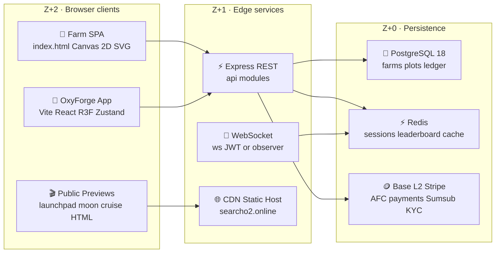
```mermaid
flowchart LR
    subgraph Z2_Client["Z+2 · Browser clients"]
        direction TB
        farmSPA["🌾 Farm SPA<br/>index.html Canvas 2D SVG"]
        oxyApp["🚀 OxyForge App<br/>Vite React R3F Zustand"]
        previews["🎬 Public Previews<br/>launchpad moon cruise HTML"]
    end

    subgraph Z1_Edge["Z+1 · Edge services"]
        direction TB
        api["⚡ Express REST<br/>api modules"]
        ws["📡 WebSocket<br/>ws JWT or observer"]
        staticHost["🌐 CDN Static Host<br/>searcho2.online"]
    end

    subgraph Z0_Data["Z+0 · Persistence"]
        direction TB
        pg["🐘 PostgreSQL 18<br/>farms plots ledger"]
        redis["⚡ Redis<br/>sessions leaderboard cache"]
        chain["🪙 Base L2 Stripe<br/>AFC payments Sumsub KYC"]
    end

    farmSPA --> api
    oxyApp --> api
    previews --> staticHost
    api --> pg
    api --> redis
    api --> chain
    ws --> redis
```

---

### 1. Core Simulation & Multi-System Game Loop


```mermaid
%%{init: {'theme':'base', 'themeVariables': { 'primaryColor':'#E8F5E9','secondaryColor':'#FFF8E1','tertiaryColor':'#E3F2FD','primaryBorderColor':'#2E7D32','lineColor':'#558B2F'}}}%%
flowchart TD
    subgraph Z2_UI ["🖥️ Z+2 · Render & HUD"]
        direction LR
        HUD["Zen HUD Telemetry"]
        CANVAS["Farm Canvas + 3D Garden"]
    end

    subgraph Z1_LOOP ["⚙️ Z+1 · 1s Tick Orchestrator"]
        A["⏱️ 1-Second Real-Time Clock Tick"] --> B["Time Compression Engine<br/>(REAL_MS_PER_GAME_HOUR · speedFactor · Δh)"]
    end

    subgraph Z0_SIM ["🌱 Z+0 · Biological & Economic Kernels"]
        direction TB
    B --> C["Advance Plot Biology & Agroforestry"]
    C --> C1["Health Decay: -0.4% to -1.2%/h"]
    C --> C2["Calculate Vegetative Stage: Sapling ➔ Young ➔ Mature"]
    C --> C3["Compute O2 Generation & Carbon Subsidies (€0.03/unit)"]
    C --> C4["Accumulate Pending Fruit & Vegetable Harvests"]
    
    B --> E["Clean Energy Grid & BESS Substation"]
    E --> E1["4-Corner Turbines Generate Clean Power (kW)"]
    E --> E2["Charge/Discharge 500 kWh LFP Battery Bank"]
    E --> E3{"Battery SoC = 100%?"}
    E3 -- Yes --> E4["Export Surplus to Regional Grid (€0.15/kWh)"]
    E3 -- No --> E5["Buffer Energy for Zero-Emission Farm Loads"]
    
    B --> F["Polyculture & Companion Ecosystems"]
    F --> F1["3-Sector Decagonal Flower Garden Freshness Decay"]
    F --> F2["Calculate Sector Diversity: Mono, Dual, or Tripartite Guild"]
    F --> F3["Spawn Waggle-Dance Bees & Peacock Butterflies"]
    F --> F4["Radiate +28% Pollinator Boost to Adjacent Plots & Crops"]
    
    B --> G["Livestock Silvopasture & Field Crops"]
    G --> G1["Advance Crop Field 4-Quadrant Growth (Wheat, Rice, Maize, Cane)"]
    G --> G2["Simulate Cattle & Sheep Grazing / Resting Cycles"]
    G --> G3["Produce Organic Milk (Cow) & Wool Fleeces (Sheep)"]
    
    B --> H["Worker AI & Autonomous Operations"]
    H --> H1["Advance Digging, Paving, Watering, Pruning, Fence Building"]
    H --> H2["Mechanized Tractor Auto-Haulage from Field to Cold Cellar"]
    H --> H3["Manhattan Waypoint Sprite Pathfinding"]
    
    B --> I["Village Foot Traffic & Commercial Hospitality"]
    I --> I1{"Living Trees > 20% Health<br/>& Main Road Paved?"}
    I1 -- Yes --> I2["Spawn 3D Pedestrian Visitors with Dynamic Speech Remarks"]
    I1 -- Yes --> I3["Generate Hospitality Revenue: Coffee House & Juice Bar"]
    I1 -- No --> I4["Foot Traffic Suspended (€0 Visitor Revenue)"]
    
    B --> J["Daily Midnight Settlement (Every 24 Game-Hours)"]
    J --> J1["Deduct Municipal Land Taxes (€2.00 / plot / day)"]
    J --> J2["Deduct Worker Payroll (Laborers, Farmers, Botanists, Engineers)"]
    J --> J3["Deduct Building Maintenance & Upkeep"]
    J --> J4["Apply Environmental Demerit Fines (€14.00 / dead plot / day)"]
    J --> J5["Amortize Bank Loan Daily Installments"]
    
    J --> K{"Treasury Balance < -€50.00?"}
    K -- Yes --> L["🚨 Trigger Community Bank Bailout Protocol"]
    K -- No --> M["Commit Frame State"]
    end

    M --> HUD
    M --> CANVAS
    L --> HUD
```

---

### 2. Agroforestry & Clean Energy System Topology

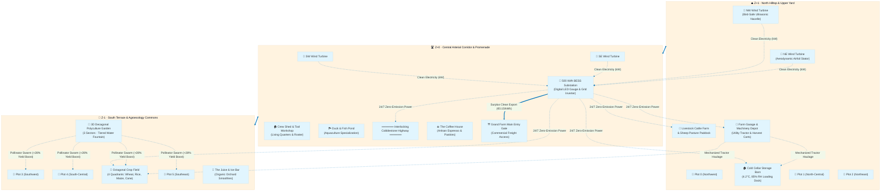
```mermaid
%%{init: {'theme':'base', 'themeVariables': { 'primaryColor':'#E1F5FE','secondaryColor':'#F1F8E9','tertiaryColor':'#FFF3E0','lineColor':'#0277BD'}}}%%
flowchart TB
    subgraph NorthTerrace ["⛰️ Z+1 · North Hilltop & Upper Yard"]
        WT_NW["💨 NW Wind Turbine<br/>(Bird-Safe Ultrasonic Nacelle)"]
        CF["🐄 Livestock Cattle Farm<br/>& Sheep Pasture Paddock"]
        P0["🌱 Plot 0 (Northwest)"]
        SB["🏚️ Cold Cellar Storage Barn<br/>(4.2°C, 85% RH Loading Dock)"]
        P1["🌱 Plot 1 (North-Central)"]
        P2["🌱 Plot 2 (Northeast)"]
        GAR["🚜 Farm Garage & Machinery Depot<br/>(Utility Tractor & Harvest Carts)"]
        WT_NE["💨 NE Wind Turbine<br/>(Aerodynamic Airfoil Stator)"]
    end

    subgraph CentralCorridor ["🛣️ Z+0 · Central Arterial Corridor & Promenade"]
        WT_SW["💨 SW Wind Turbine"]
        BESS["🔋 500 kWh BESS Substation<br/>(Digital LED Gauge & Grid Inverter)"]
        CS["🏠 Crew Shed & Tool Workshop<br/>(Living Quarters & Roster)"]
        POND["🏞️ Duck & Fish Pond<br/>(Aquaculture Specialization)"]
        HIGHWAY["══════ Interlocking Cobblestone Highway ══════"]
        COFFEE["☕ The Coffee House<br/>(Artisan Espresso & Pastries)"]
        GATE["⛩️ Grand Farm Main Entry Gate<br/>(Commercial Freight Access)"]
        WT_SE["💨 SE Wind Turbine"]
    end

    subgraph SouthTerrace ["🌾 Z-1 · South Terrace & Agroecology Commons"]
        GARDEN["🌷 3D Decagonal Polyculture Garden<br/>(3 Sectors · Tiered Water Fountain)"]
        P3["🌱 Plot 3 (Southwest)"]
        P4["🌱 Plot 4 (South-Central)"]
        CROP["🌾 Octagonal Crop Field<br/>(4 Quadrants: Wheat, Rice, Maize, Cane)"]
        P5["🌱 Plot 5 (Southeast)"]
        JUICE["🧃 The Juice & Ice Bar<br/>(Organic Orchard Smoothies)"]
    end

    NorthTerrace <===> CentralCorridor
    CentralCorridor <===> SouthTerrace
    
    WT_NW & WT_NE & WT_SW & WT_SE -. Clean Electricity (kW) .-> BESS
    BESS -. 24/7 Zero-Emission Power .-> SB & GAR & CF & CROP & HIGHWAY
    BESS == Surplus Clean Export (€0.15/kWh) ==> GATE
    GARDEN -. Pollinator Swarm (+28% Yield Boost) .-> P3 & P4 & CROP & P5
    GAR -. Mechanized Tractor Haulage .-> CROP & SB
```

---

### 3. Polyculture Companion Planting & Guild Matrix

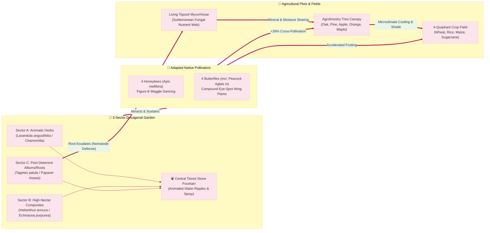
```mermaid
%%{init: {'theme':'base', 'themeVariables': { 'primaryColor':'#FCE4EC','secondaryColor':'#E8F5E9','tertiaryColor':'#FFF9C4','lineColor':'#AD1457'}}}%%
flowchart LR
    subgraph FlowerGuild ["🌷 3-Sector Decagonal Garden"]
        direction TB
        SEC_A["Sector A: Aromatic Herbs<br/>(Lavandula angustifolia / Chamomilla)"]
        SEC_B["Sector B: High-Nectar Composites<br/>(Helianthus annuus / Echinacea purpurea)"]
        SEC_C["Sector C: Pest-Deterrent Alliums/Roots<br/>(Tagetes patula / Papaver rhoeas)"]
        FOUNT["⛲ Central Tiered Stone Fountain<br/>(Animated Water Ripples & Spray)"]
    end

    subgraph InsectaryFauna ["🐝 Adapted Native Pollinators"]
        direction TB
        BEES["4 Honeybees (Apis mellifera)<br/>Figure-8 Waggle Dancing"]
        BFLY["4 Butterflies (incl. Peacock Aglais io)<br/>Compound Eye-Spot Wing Flares"]
    end

    subgraph CropCanopy ["🌾 Agricultural Plots & Fields"]
        direction TB
        CANOPY["Agroforestry Tree Canopy<br/>(Oak, Pine, Apple, Orange, Maple)"]
        QUAD["4-Quadrant Crop Field<br/>(Wheat, Rice, Maize, Sugarcane)"]
        SOIL["Living Topsoil Mycorrhizae<br/>(Subterranean Fungal Nutrient Web)"]
    end

    SEC_A & SEC_B & SEC_C --> FOUNT
    FlowerGuild ==>|Attracts & Sustains| InsectaryFauna
    
    InsectaryFauna == +28% Cross-Pollination ==> CANOPY
    InsectaryFauna == Accelerated Fruiting ==> QUAD
    SEC_C == Root Exudates (Nematode Defense) ==> SOIL
    CANOPY == Microclimate Cooling & Shade ==> QUAD
    SOIL == Mineral & Moisture Sharing ==> CANOPY
```

---

### 4. Multi-Modal Logistics & Freight Dispatch Pipeline

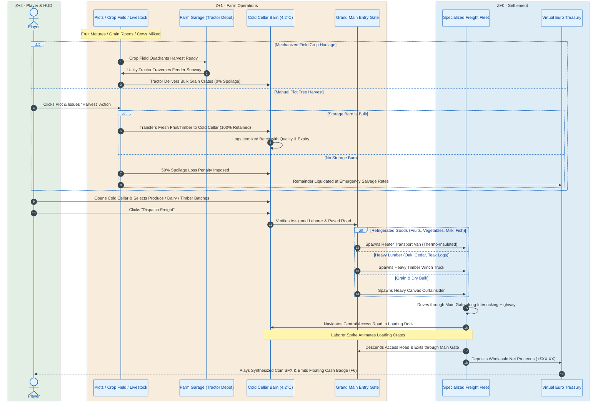
```mermaid
%%{init: {'theme':'base', 'themeVariables': { 'actorBkg':'#E3F2FD','actorBorder':'#1565C0','actorTextColor':'#0D47A1','signalColor':'#37474F'}}}%%
sequenceDiagram
    autonumber
    box rgba(232,245,233,0.9) Z+2 · Player & HUD
        actor Player
    end
    box rgba(255,243,224,0.9) Z+1 · Farm Operations
        participant Field as Plots / Crop Field / Livestock
        participant Garage as Farm Garage (Tractor Depot)
        participant Storage as Cold Cellar Barn (4.2°C)
        participant Gate as Grand Main Entry Gate
    end
    box rgba(227,242,253,0.9) Z+0 · Settlement
        participant Carrier as Specialized Freight Fleet
        participant Bank as Virtual Euro Treasury
    end

    Note over Field: Fruit Matures / Grain Ripens / Cows Milked
    
    alt Mechanized Field Crop Haulage
        Field->>Garage: Crop Field Quadrants Harvest Ready
        Garage->>Field: Utility Tractor Traverses Feeder Subway
        Field->>Storage: Tractor Delivers Bulk Grain Crates (0% Spoilage)
    else Manual Plot Tree Harvest
        Player->>Field: Clicks Plot & Issues "Harvest" Action
        alt Storage Barn Is Built
            Field->>Storage: Transfers Fresh Fruit/Timber to Cold Cellar (100% Retained)
            Storage->>Storage: Logs Itemized Batch with Quality & Expiry
        else No Storage Barn
            Field->>Storage: 50% Spoilage Loss Penalty Imposed
            Field->>Bank: Remainder Liquidated at Emergency Salvage Rates
        end
    end

    Player->>Storage: Opens Cold Cellar & Selects Produce / Dairy / Timber Batches
    Player->>Storage: Clicks "Dispatch Freight"
    Storage->>Gate: Verifies Assigned Laborer & Paved Road
    
    alt Refrigerated Goods (Fruits, Vegetables, Milk, Fish)
        Gate->>Carrier: Spawns Reefer Transport Van (Thermo-Insulated)
    else Heavy Lumber (Oak, Cedar, Teak Logs)
        Gate->>Carrier: Spawns Heavy Timber Winch Truck
    else Grain & Dry Bulk
        Gate->>Carrier: Spawns Heavy Canvas Curtainsider
    end

    Carrier->>Carrier: Drives through Main Gate along Interlocking Highway
    Carrier->>Storage: Navigates Central Access Road to Loading Dock
    Note over Storage,Carrier: Laborer Sprite Animates Loading Crates
    Carrier->>Gate: Descends Access Road & Exits through Main Gate
    Carrier->>Bank: Deposits Wholesale Net Proceeds (+€XX.XX)
    Bank-->>Player: Plays Synthesized Coin SFX & Emits Floating Cash Badge (+€)
```

---

### 5. Macro-Economic Balance & Cash Flow

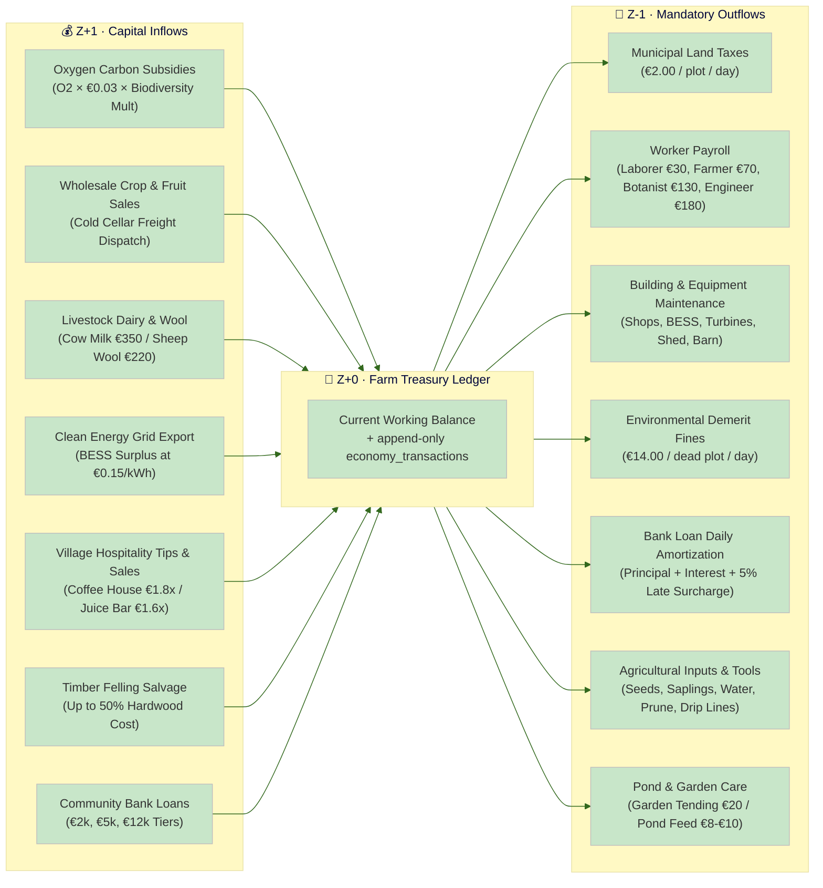
```mermaid
%%{init: {'theme':'base', 'themeVariables': { 'primaryColor':'#C8E6C9','secondaryColor':'#FFCDD2','tertiaryColor':'#FFF9C4','lineColor':'#33691E'}}}%%
flowchart LR
    subgraph Inflows ["💰 Z+1 · Capital Inflows"]
        I1["Oxygen Carbon Subsidies<br/>(O2 × €0.03 × Biodiversity Mult)"]
        I2["Wholesale Crop & Fruit Sales<br/>(Cold Cellar Freight Dispatch)"]
        I3["Livestock Dairy & Wool<br/>(Cow Milk €350 / Sheep Wool €220)"]
        I4["Clean Energy Grid Export<br/>(BESS Surplus at €0.15/kWh)"]
        I5["Village Hospitality Tips & Sales<br/>(Coffee House €1.8x / Juice Bar €1.6x)"]
        I6["Timber Felling Salvage<br/>(Up to 50% Hardwood Cost)"]
        I7["Community Bank Loans<br/>(€2k, €5k, €12k Tiers)"]
    end

    subgraph Treasury ["🏦 Z+0 · Farm Treasury Ledger"]
        direction TB
        BAL["Current Working Balance<br/>+ append-only economy_transactions"]
    end

    subgraph Outflows ["💸 Z-1 · Mandatory Outflows"]
        O1["Municipal Land Taxes<br/>(€2.00 / plot / day)"]
        O2["Worker Payroll<br/>(Laborer €30, Farmer €70, Botanist €130, Engineer €180)"]
        O3["Building & Equipment Maintenance<br/>(Shops, BESS, Turbines, Shed, Barn)"]
        O4["Environmental Demerit Fines<br/>(€14.00 / dead plot / day)"]
        O5["Bank Loan Daily Amortization<br/>(Principal + Interest + 5% Late Surcharge)"]
        O6["Agricultural Inputs & Tools<br/>(Seeds, Saplings, Water, Prune, Drip Lines)"]
        O7["Pond & Garden Care<br/>(Garden Tending €20 / Pond Feed €8-€10)"]
    end

    I1 & I2 & I3 & I4 & I5 & I6 & I7 --> Treasury
    Treasury --> O1 & O2 & O3 & O4 & O5 & O6 & O7
```

---

### 6. Plot Lifecycle State Machine

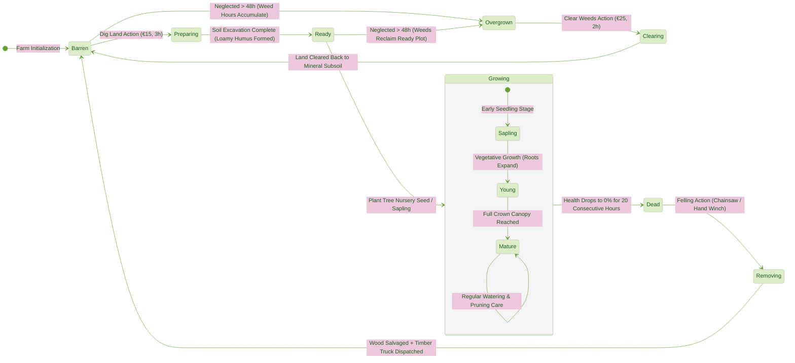
```mermaid
%%{init: {'theme':'base', 'themeVariables': { 'primaryColor':'#DCEDC8','primaryTextColor':'#1B5E20','lineColor':'#689F38'}}}%%
stateDiagram-v2
    direction LR
    [*] --> Barren: Farm Initialization

    Barren --> Preparing: Dig Land Action (€15, 3h)
    Barren --> Overgrown: Neglected > 48h (Weed Hours Accumulate)
    
    Preparing --> Ready: Soil Excavation Complete (Loamy Humus Formed)
    
    Ready --> Growing: Plant Tree Nursery Seed / Sapling
    Ready --> Overgrown: Neglected > 48h (Weeds Reclaim Ready Plot)
    
    Overgrown --> Clearing: Clear Weeds Action (€25, 2h)
    Clearing --> Barren: Land Cleared Back to Mineral Subsoil
    
    state Growing {
        [*] --> Sapling: Early Seedling Stage
        Sapling --> Young: Vegetative Growth (Roots Expand)
        Young --> Mature: Full Crown Canopy Reached
        Mature --> Mature: Regular Watering & Pruning Care
    }
    
    Growing --> Dead: Health Drops to 0% for 20 Consecutive Hours
    
    Dead --> Removing: Felling Action (Chainsaw / Hand Winch)
    Removing --> Barren: Wood Salvaged + Timber Truck Dispatched
```

---

### 7. Manhattan Road & Waypoint Navigation Network

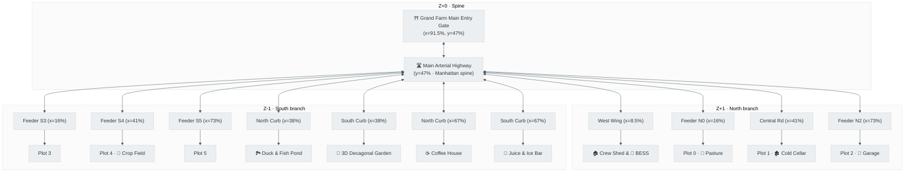
```mermaid
%%{init: {'theme':'base', 'themeVariables': { 'primaryColor':'#ECEFF1','secondaryColor':'#E8F5E9','lineColor':'#455A64'}}}%%
flowchart TD
    GATE["⛩️ Grand Farm Main Entry Gate<br/>(x=91.5%, y=47%)"] <--> HIGHWAY["🛣️ Main Arterial Highway<br/>(y=47% · Manhattan spine)"]

    HIGHWAY <--> FS_NW["West Wing (x=8.5%)"] --> CS["🏠 Crew Shed & 🔋 BESS"]
    HIGHWAY <--> FS_P0["Feeder N0 (x=16%)"] --> P0["Plot 0 · 🐄 Pasture"]
    HIGHWAY <--> FS_P1["Central Rd (x=41%)"] --> P1["Plot 1 · 🏚️ Cold Cellar"]
    HIGHWAY <--> FS_P2["Feeder N2 (x=73%)"] --> P2["Plot 2 · 🚜 Garage"]

    HIGHWAY <--> FS_P3["Feeder S3 (x=16%)"] --> P3["Plot 3"]
    HIGHWAY <--> FS_P4["Feeder S4 (x=41%)"] --> P4["Plot 4 · 🌾 Crop Field"]
    HIGHWAY <--> FS_P5["Feeder S5 (x=73%)"] --> P5["Plot 5"]

    HIGHWAY <--> AP_POND["North Curb (x=38%)"] --> POND["🏞️ Duck & Fish Pond"]
    HIGHWAY <--> AP_GARDEN["South Curb (x=38%)"] --> GARDEN["🌷 3D Decagonal Garden"]
    HIGHWAY <--> AP_CAFE["North Curb (x=67%)"] --> CAFE["☕ Coffee House"]
    HIGHWAY <--> AP_JUICE["South Curb (x=67%)"] --> JUICE["🧃 Juice & Ice Bar"]

    subgraph Z1_North ["Z+1 · North branch"]
        FS_NW
        FS_P0
        FS_P1
        FS_P2
        P0
        P1
        P2
        CS
    end
    subgraph Z0_Spine ["Z+0 · Spine"]
        GATE
        HIGHWAY
    end
    subgraph Z_1_South ["Z-1 · South branch"]
        FS_P3
        FS_P4
        FS_P5
        AP_POND
        AP_GARDEN
        AP_CAFE
        AP_JUICE
        P3
        P4
        P5
        POND
        GARDEN
        CAFE
        JUICE
    end
```

---

### 8. OxyForge Mission Screen & 3D Flight Pipeline

Mirrors the React `GameApp` screen router (`src/components/game/GameApp.tsx`) and persisted Zustand mission state (`oxyforge-save-v1`).

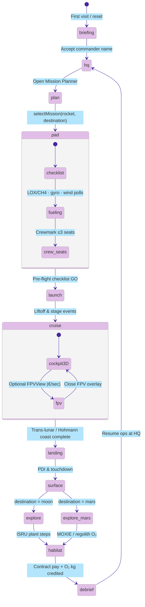
```mermaid
%%{init: {'theme':'base', 'themeVariables': { 'primaryColor':'#E1BEE7','secondaryColor':'#B3E5FC','lineColor':'#4527A0'}}}%%
stateDiagram-v2
    direction TB

    [*] --> briefing: First visit / reset
    briefing --> hq: Accept commander name

    hq --> plan: Open Mission Planner
    plan --> pad: selectMission(rocket, destination)
    pad --> launch: Pre-flight checklist GO
    launch --> cruise: Liftoff & stage events
    cruise --> landing: Trans-lunar / Hohmann coast complete
    landing --> surface: PDI & touchdown

    surface --> explore: destination = moon
    surface --> explore_mars: destination = mars
    explore --> habitat: ISRU plant steps
    explore_mars --> habitat: MOXIE / regolith O₂

    habitat --> debrief: Contract pay + O₂ kg credited
    debrief --> hq: Resume ops at HQ

    state pad {
        [*] --> checklist
        checklist --> fueling: LOX/CH4 · gyro · wind polls
        fueling --> crew_seats: Crewmark ≤3 seats
    }

    state cruise {
        [*] --> cockpit3D
        cockpit3D --> fpv: Optional FPVView (€/sec)
        fpv --> cockpit3D: Close FPV overlay
    }
```

---

### 9. Authentication, Guest Merge & Session Security

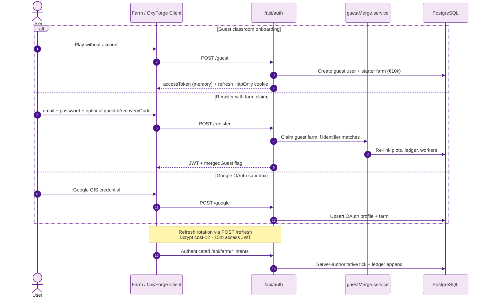
```mermaid
%%{init: {'theme':'base', 'themeVariables': { 'actorBkg':'#F3E5F5','actorBorder':'#6A1B9A','signalColor':'#4A148C'}}}%%
sequenceDiagram
    autonumber
    actor User
    participant SPA as Farm / OxyForge Client
    participant API as /api/auth
    participant Merge as guestMerge.service
    participant DB as PostgreSQL

    alt Guest classroom onboarding
        User->>SPA: Play without account
        SPA->>API: POST /guest
        API->>DB: Create guest user + starter farm (€10k)
        API-->>SPA: accessToken (memory) + refresh HttpOnly cookie
    else Register with farm claim
        User->>SPA: email + password + optional guestId/recoveryCode
        SPA->>API: POST /register
        API->>Merge: Claim guest farm if identifier matches
        Merge->>DB: Re-link plots, ledger, workers
        API-->>SPA: JWT + mergedGuest flag
    else Google OAuth sandbox
        User->>SPA: Google GIS credential
        SPA->>API: POST /google
        API->>DB: Upsert OAuth profile + farm
    end

    Note over SPA,API: Refresh rotation via POST /refresh<br/>Bcrypt cost-12 · 15m access JWT

    SPA->>API: Authenticated /api/farm/* intents
    API->>DB: Server-authoritative tick + ledger append
```

---

### 10. Server-Authoritative API & Anti-Cheat Intent Flow

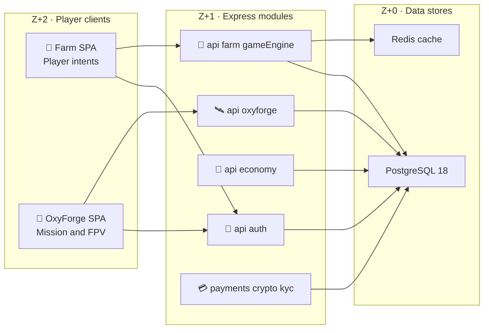
```mermaid
flowchart LR
    subgraph Z2_Clients["Z+2 · Player clients"]
        direction TB
        farmSPA["🌾 Farm SPA<br/>Player intents"]
        oxySPA["🚀 OxyForge SPA<br/>Mission and FPV"]
    end

    subgraph Z1_API["Z+1 · Express modules"]
        direction TB
        auth["🔐 api auth"]
        farm["🌱 api farm gameEngine"]
        economy["📒 api economy"]
        oxy["🛰️ api oxyforge"]
        pay["💳 payments crypto kyc"]
    end

    subgraph Z0_Store["Z+0 · Data stores"]
        direction TB
        pg["PostgreSQL 18"]
        redis["Redis cache"]
    end

    farmSPA --> auth
    oxySPA --> auth
    farmSPA --> farm
    oxySPA --> oxy
    auth --> pg
    farm --> pg
    economy --> pg
    oxy --> pg
    pay --> pg
    farm --> redis
```

**Intent pipeline:** client sends **actions** (`plant`, `harvest`, `build`) → Zod validation + rate limits → `gameEngine` recomputes elapsed hours from `last_tick_timestamp` → rejects impossible state transitions → writes **append-only** `economy_transactions`.

---

### 11. WebSocket Live Sync & Observer Mode

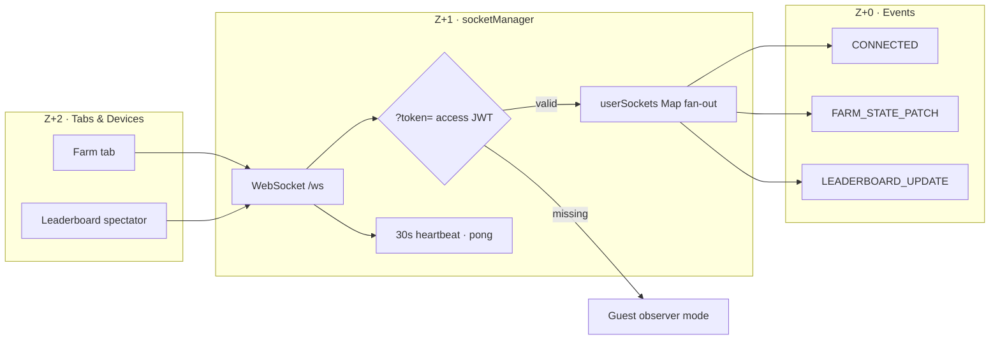
```mermaid
flowchart LR
    subgraph Z2 ["Z+2 · Tabs & Devices"]
        TAB1["Farm tab"]
        TAB2["Leaderboard spectator"]
    end

    subgraph Z1 ["Z+1 · socketManager"]
        WSS["WebSocket /ws"]
        JWT{"?token= access JWT"}
        FAN["userSockets Map fan-out"]
        PING["30s heartbeat · pong"]
    end

    subgraph Z0 ["Z+0 · Events"]
        EV1["CONNECTED"]
        EV2["FARM_STATE_PATCH"]
        EV3["LEADERBOARD_UPDATE"]
    end

    TAB1 --> WSS
    TAB2 --> WSS
    WSS --> JWT
    JWT -->|valid| FAN
    JWT -->|missing| OBS["Guest observer mode"]
    FAN --> EV1
    FAN --> EV2
    FAN --> EV3
    WSS --> PING
```

---

### 12. Payments, Crypto Ledger & KYC On-Ramp

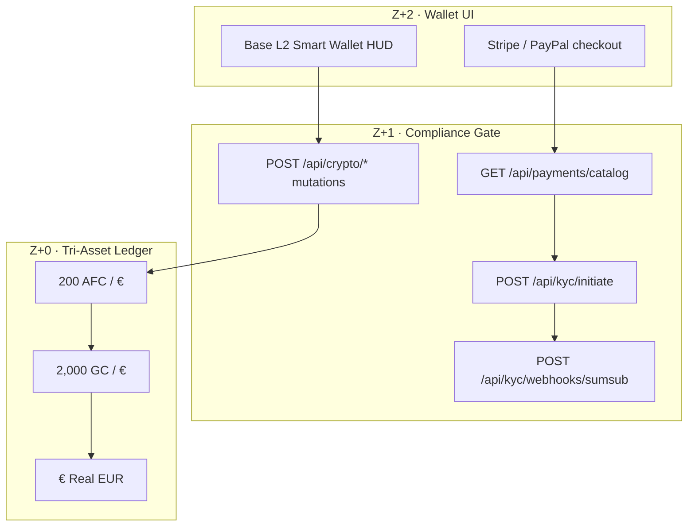
```mermaid
flowchart TB
    subgraph Z2_UI ["Z+2 · Wallet UI"]
        WAL["Base L2 Smart Wallet HUD"]
        TOP["Stripe / PayPal checkout"]
    end

    subgraph Z1_API ["Z+1 · Compliance Gate"]
        CAT["GET /api/payments/catalog"]
        KYC["POST /api/kyc/initiate"]
        HOOK["POST /api/kyc/webhooks/sumsub"]
        CRYPTO["POST /api/crypto/* mutations"]
    end

    subgraph Z0_LEDGER ["Z+0 · Tri-Asset Ledger"]
        EUR["€ Real EUR"]
        AFC["200 AFC / €"]
        GC["2,000 GC / €"]
    end

    WAL --> CRYPTO
    TOP --> CAT
    CAT --> KYC
    KYC --> HOOK
    CRYPTO --> AFC
    AFC --> GC
    GC --> EUR
```

---

## 🔬 Deep Dive: Game Mechanics & Subsystems

### 3D Decagonal 3-Sector Polyculture Flower Garden

The **Botanical Flower Garden (€300 · 4h)** is an architectural centerpiece engineered as a regular 10-sided polygon (decagon) with authentic depth, tiered elevation, and companion planting biology:

```
                       Sector A (North-West)
                            ┌────────┐
                       ────/          \────
                     /      \        /      \
                    /        \  ⛲  /        \
           Sector C │          (  )          │ Sector B
         (South-West) \       /  ||  \       / (East)
                       ────\ /   ||   \ /────
                            └────────┘
```

- **Decagonal Raised Bed Geometry:** Formed by 10 precision vertex angles with stepped perimeter stone curb coping, rich dark loamy soil fill, and 3 radial flagstone paver dividers separating the bed into 3 equal 120-degree planting sectors.
- **Central Carved Water Fountain:** A hand-chiseled tiered stone fountain with an ornate finial basin, continuously cycling animated water ripples and crystalline droplet spray that quenches pollinators and hydrates flower roots.
- **12 Authentic Botanical Species with Binomial Nomenclature:**

| Botanical Name | Common Name | Icon | Grow (h) | Yield | Nectar | Pollinator Guild | Companion Synergy Perk |
|---|---|:---:|:---:|:---:|:---:|---|---|
| *Tulipa gesneriana* | Tulips | 🌷 | 2.2h | €48 | 3/5 | Early Spring Bumblebees | +10% Farm Happiness & Spring Rep |
| *Rosa gallica* | Heritage Roses | 🌹 | 3.5h | €75 | 4/5 | Wild Solitary & Honeybees | +15% Visitor Tip Frequency |
| *Helianthus annuus* | Giant Sunflowers | 🌻 | 3.8h | €68 | 5/5 | Honeybees & Goldfinches | +20% Honey & Wild Bird Attraction |
| *Bellis perennis* | English Daisies | 🌼 | 1.8h | €38 | 3/5 | Hoverflies & Ladybugs | Natural aphid predation for vegetables |
| *Lavandula angustifolia* | True Lavender | 🪻 | 2.8h | €62 | 5/5 | *Apis mellifera* (Honeybees) | +25% Honey Yield & Calming Terpene Aroma |
| *Tagetes patula* | French Marigolds | 🏵️ | 2.0h | €42 | 3/5 | Beneficial Parasitoid Wasps | Root exudates eliminate soil nematodes |
| *Echinacea purpurea* | Purple Coneflower | 🪷 | 2.6h | €55 | 5/5 | Monarch & Swallowtails | +20% Butterfly Diversity & Herbal Essence |
| *Matricaria chamomilla* | German Chamomile | 🌾 | 2.1h | €45 | 4/5 | Syrphid Flies & Honeybees | "Plant Doctor" vitality boost to neighbors |
| *Papaver rhoeas* | Scarlet Corn Poppy | 🌺 | 2.4h | €50 | 4/5 | Bumblebees & Beetles | High-pollen reservoir for emerging queens |
| *Iris germanica* | German Iris | 🪻 | 3.2h | €70 | 4/5 | Long-tongued Bumblebees | +12 Farm Reputation & Stately Aesthetic |
| *Centaurea cyanus* | Field Cornflower | 🔷 | 2.3h | €48 | 4/5 | Solitary Leafcutter Bees | Natural field edge stabilization |
| *Dahlia pinnata* | Dinnerplate Dahlia | 🌸 | 3.6h | €80 | 4/5 | Migrating Late Butterflies | +18% Cut-Flower Market Bouquet Premium |

- **Polyculture Companion Guild Multipliers:**
  - **Mono Cultivation (1 Sector):** Standard bloom and yield metrics.
  - **Dual-Guild (2 Distinct Species):** \(+8\) Farm Reputation, \(+12\%\) Pollinator Density, \(+15\%\) Visitor Tip Frequency, \(+15\%\) Biodiversity Index.
  - **Full Tripartite Guild (3 Distinct Species):** \(+18\) Farm Reputation, \(+28\%\) Pollinator Density, \(+30\%\) Visitor Tip Frequency, \(+35\%\) Biodiversity Index.
- **Dynamic Pollinator Swarm:** Features 4 worker honeybees (*Apis mellifera*) performing figure-8 waggle dances and 4 colorful butterflies—including the rare European Peacock Butterfly (*Aglais io*) with brilliant violet, bronze, and cobalt eye-spot wings—that gather around sectors when in bloom.

---

### Clean Energy Microgrid & 500 kWh BESS Substation

```
   [NW Turbine]                                                   [NE Turbine]
        \                                                               /
         └───► [500 kWh LFP BESS Substation] ◄─── Zero-Emission Farm ──┘
                    │            │
                    ▼            ▼
             [Farm Microgrid]  [Grid Export: €0.15/kWh]
        ┌───────────────────────────────────────────────────────────────┐
        │ LED Display: 482 / 500 kWh [████████████████░░] 96.4% SoC     │
        └───────────────────────────────────────────────────────────────┘
         ┌───► [SW Turbine]                               [SE Turbine] ◄───┘
```

- **4-Corner Perimeter Wind Turbines (€275 · 4h each):** Located on elevated terrain corners (NW, NE, SW, SE). Engineered with 3-blade aerodynamic airfoils, procedural RPM spin rates proportional to real-time wind gusts, projected dynamic ground shadows, and high-frequency bird-safe ultrasonic acoustic deterrents.
- **Industrial BESS Substation (€800 · 5h):**
  - **500 kWh LiFePO₄ (LFP) Battery Chemistry:** High thermal stability, zero risk of thermal runaway, and 6,000+ deep charge/discharge cycles.
  - **High-Tech Digital LED Energy Gauge:** Live on-canvas telemetry displaying current kilowatt-hours, battery percentage bar, and net generation flow.
  - **Automated Grid Feed-in Export Tariff:** Once the battery reaches 100% capacity (500 kWh), excess generation is automatically exported to the municipal clean power grid at **€0.15 per kWh**, generating passive revenue for your farmstead.
  - **Engineer Commissioning Checklist:** Certified Engineers perform routine inverter calibration, cell balancing, ground-fault insulation checks, and liquid cooling circuit inspections.

---

### Octagonal Polyculture Crop Field & Mechanized Tractor

- **Octagonal 4-Quadrant Polyculture Bed (€350 · 5h):** Located on the south-central terrace, this 8-sided agricultural field allows rotation and simultaneous cultivation of staple food crops:
  - 🌾 **Wheat (*Triticum aestivum* · €20):** Foundation staple grain yielding €55 in 3.0h.
  - 🍚 **Paddy Rice (*Oryza sativa* · €25):** High-moisture grain yielding €70 in 3.8h.
  - 🌽 **Maize (*Zea mays* · €24):** High-yield indigenous crop yielding €65 in 3.5h.
  - 🎋 **Sugarcane (*Saccharum officinarum* · €35):** Dense perennial grass yielding €95 in 4.8h.
  - 🥕 **Carrots**, 🍅 **Tomatoes**, 🥔 **Potatoes**, and 🍆 **Eggplants** for flexible vegetable rotations.
- **Mechanized Farm Garage (€350 · 4h) & Tractor Haulage:** Unlocks a dedicated green utility tractor that traverses feeder subways, collecting harvests from crop quadrants and delivering crates directly to the Cold Cellar Barn.

---

### Livestock Cattle & Sheep Pasture Farm

- **Silvopasture Pasture Paddock (€400 · 5h):** A 4-chamber timber cattle barn and enclosed grass pasture situated on the northwest terrace:
  - 🐄 **Dairy Cattle (*Bos taurus* · €150):** Graze on sweet clover and meadow fescue; produce rich organic **Farm Milk (Produce Value: €350 / 30h)** with adult salvage value of €1,200.
  - 🐑 **Wool Sheep (*Ovis aries* · €75):** Gentle grazers that manicure grass without topsoil compaction; yield lanolin-rich **Wool Fleeces (Produce Value: €220 / 25h)** with adult salvage value of €600.
- **Timber Perimeter Fence Construction (€180 · 2.5h):** Laborers construct a wooden post-and-rail boundary fence to shield grazing herds from predators and keep livestock safely away from agricultural plots.
- **Behavioral State Machine:** Cattle and sheep cycle smoothly between animated grazing, meadow walking, and resting states, accompanied by procedural lowing and bleating soundscapes.

---

### Living Botanical & Ecological Theory Encyclopedia

Accessible directly via the 2-Column Menu Dock or by inspecting botanical specimens, the **Living Encyclopedia** provides a 3-tab educational repository:

1. **Tab 1: 72 Botanical Trees across 6 Global Biomes:**
   - Spans Central Europe, Nordic Boreal, Mediterranean, East African Savannah, Amazon Rainforest, and Japanese Highlands.
   - Comprehensive profiles: Latin binomial names, photosynthesis rates, carbon capture ratings (kg CO₂/year), wood density, canopy spread, and ethnobotanical lore.
2. **Tab 2: 12 Botanical Flowers:**
   - Profiles all 12 flower species with scientific names, botanical families, nectar ratings, pollinator attractors, companion perks, and medicinal/folklore trivia.
3. **Tab 3: 6 Peer-Reviewed Clean Tech Theory Guides:**
   - **Agroecology Polyculture:** Root stratification, olfactory pest confusion, mycorrhizal fungal networks, microclimate buffering.
   - **Rotational Grazing & Silvopasture:** The silvopastoral shade loop, intensive grazing pulses, liquid carbon exudate pathways, closed-loop manure cycling.
   - **Renewable Energy & Microgrids:** Agricultural electrification, microgrid independence, agrivoltaic co-location, circular power economics.
   - **Wind Turbines & Aerodynamics:** Airfoil lift principles, the Betz limit (59.3% kinetic ceiling), electromagnetic generator induction, bird-safe ultrasonic acoustic deterrents.
   - **BESS Substation Engineering:** Renewable intermittency smoothing, diurnal peak shaving, LiFePO₄ chemical safety, BMS microcontroller telemetry.
   - **Photosynthesis & Carbon Sequestration:** Thylakoid water photolysis ($2	ext{H}_2	ext{O} 	o 4	ext{H}^+ + 4e^- + 	ext{O}_2$), Calvin-Benson Rubisco cycle, permanent cellulose/lignin wood sinks.

---

### Plot Management & Biological Health Decay

Each agricultural plot tracks real-time biological telemetry:
- **Metabolic Health Decay:** Trees naturally burn metabolic reserves:
  $$\text{Fruit Trees: } -0.8\%/\text{h} \quad|\quad \text{Evergreen: } -0.4\%/\text{h} \quad|\quad \text{Deciduous: } -0.5\%/\text{h}$$
- **Chlorophyll Cut-Off (Health $\le 20\%$):** Photosynthesis and fruit accumulation immediately halt when health falls to or below 20%.
- **Zero-Health Streak & Tree Death:** If a plot sits at $0\%$ health for **20 consecutive game-hours**, the tree permanently dies (`status: 'dead'`).
- **Demerit Fines on Rot:** Unsalvaged dead trees rack up an environmental violation fine of **€14.00 per plot per day** plus 1 Demerit per day. A neglected farm with 6 dead plots bleeds **€84.00/day**, triggering rapid insolvency.

---

### Tree Taxonomy & Multi-Strata Agroforestry

| Category | Species Examples | Cost | Maturation (h) | Max O₂/h | Late Revenue | Ecological Niche |
|---|---|:---:|:---:|:---:|:---:|---|
| **Oxygen Trees** | Oak, Pine, Maple, Poplar | €135–€190 | 48h–72h | **5.0–6.0** | — | Deep-rooting subterranean miners, massive carbon sinks |
| **Fruit Trees** | Apple, Orange, Mango | €120–€140 | 36h–48h | 3.3–3.5 | **€0.90–€1.00/h** | High commercial yield, nectar forage for honeybees |
| **Vegetables** | Tomato, Potato, Carrot, Onion | €15–€18 | 18h–24h | 1.0–1.8 | **€0.60–€0.85/h** | Rapid cash crop turnaround, companion weed suppressors |
| **Timber Trees** | Teak, Cedar, Eucalyptus | €160–€220 | 80h–120h | 4.0–5.5 | **€35–€65 Wood** | Heavy structural wood salvage payoff upon commercial felling |
| **Biodiversity Trees** | Cherry Blossom, Birch, Acacia | €85–€115 | 30h–42h | 3.0–4.0 | **+Pollinators** | Grants \(+3\) to \(+5\) Farm Reputation and attracts pollinators |

---

### Labor & Crew Management

The **Crew Shed (€200 · 3h)** allows hiring specialized workers who physically walk along Manhattan feeder paths to carry out tasks:

| Worker Role | Wage/Day | Speed Multiplier | Autonomous Responsibilities |
|---|:---:|:---:|---|
| **Laborer** 👷 | €30.00 | $+50%$ Task Speed | Digs barren land, clears overgrowth, fells dead trees, builds fences, operates cold cellar loading dock. |
| **Farmer** 🧑‍🌾 | €70.00 | $+40%$ Vegetative Growth | Plants saplings, performs scheduled watering and pruning, harvests mature crops into storage. |
| **Specialist Botanist** 👩‍🔬 | €130.00 | $+60%$ Vegetative Growth | Formulates bio-fertilizer, diagnoses canopy blights, boosts species biodiversity index. |
| **Certified Engineer** 🛠️ | €180.00 | $+10%$ Microgrid Yield | Commissions wind turbines, services BESS battery bank, maintains automated drip irrigation. |

---

### Infrastructure, Roads & Village Commons

```
  Upper Yard (Top):        [ Storage Barn & Loading Dock ] (behind Plot 1)
  North Field:             [ Plot 0 ]      [ Plot 1 ]      [ Plot 2 ]
  North Amenities:                 [ Duck Pond ]       [ Coffee House ]
  ────────────────────────────────────────────────────────────────────────
  Main Arterial Road:  ═════════════════ Paved Highway ═══════════════════
  ────────────────────────────────────────────────────────────────────────
  South Amenities:                 [ Garden ]          [ Juice Bar ]
  South Field:             [ Plot 3 ]      [ Plot 4 ]      [ Plot 5 ]
  West Wing:           [ Crew Shed & BESS ]        East Entrance: [ Main Gate ]
```

1. **Storage Barn Depot:** Climate-controlled cold storage. Prevents 50% crop spoilage, maintains discrete crop batches, and supports modular warehouse expansions (+150 capacity for €500).
2. **Main Arterial Road & Gate:** Interlocking cobblestone thoroughfare connecting the Grand East Gate to plots, village shops, and storage depot.
3. **Aquaculture Duck & Fish Pond:** Specializes into Fish Farming (trout) or Duck Farming. Feeds into cold cellar storage or direct sales.
4. **The Coffee House & Juice Bar:** Artisan timber cafe and tropical juice pavilion serving passing pedestrians when living trees thrive.

---

### Oxygen Economy, Logistics & Banking

#### Oxygen Monetization Formula
$$\text{HourlyRevenue} = \text{O2Rate (€0.03)} \times \sum (\text{Plot O2 Output}) \times (1 + \sum \text{Bonuses})$$

#### Logistics Freight Fleet
Selling harvested goods requires active supply chain execution:
1. Select produce, dairy, or lumber batches in the Cold Cellar inventory.
2. An assigned Laborer packages crates at the loading dock.
3. Specialized transport dispatches:
   - **Refrigerated Van:** For fruits, vegetables, milk, and fish.
   - **Timber Hauler Truck:** For felling salvage and heavy logs.
   - **Canvas Curtainsider:** For dry bulk and grains.
4. Carrier drives through the Main Gate, loads at the dock, exits to market, and credits net wholesale revenue with metallic coin sound effects!

#### Community Banking & Debt Amortization
- **Loan Tiers:**
  - Small Operational Loan: €2,000 (5% interest, 10 days, €210/day).
  - Commercial Expansion Loan: €5,000 (8% interest, 20 days, €270/day).
  - Farm Mortgage: €12,000 (12% interest, 40 days, €336/day).
- **Bankruptcy Bailout Threshold (-€50.00):** If cash falls below -€50.00, the Community Bank intervenes with debt restructuring or debt relief options.

---

### Ecosystem Synergies & 3D Visitor Foot-Traffic

#### Farm Reputation Formula
$$\text{Reputation} = \text{BuildingBonuses} + \text{RoadBonuses} + \text{AvgCropHealth} \times 0.15 + (\text{LivingSpecies} \times 3) - (\text{DeadPlots} \times 4) - (\text{Demerits} \times 2)$$

#### Active Farm Synergies
- **Forest Canopy Bonus (+10%):** Awarded when all 6 starting plots are actively cultivated with healthy trees.
- **Diverse Species Guild (+15%):** Awarded when 2 or more distinct species flourish concurrently.
- **Clean Energy Microgrid Bonus (+15%):** Awarded when wind turbines and BESS substation operate at full capacity.
- **Visitor Magnet Combo (+20%):** Achieved by operating the Garden, Pond, and at least one village shop concurrently.

#### 3D Pedestrian Visitors with Dynamic Speech Remarks
Strolling visitors feature responsive path-following AI, clothing variations, and contextual speech bubbles:
- *"The fragrance of this lavender is heavenly!"* (near blooming garden)
- *"Those clean wind turbines are so whisper quiet."* (near turbine corridor)
- *"Such healthy, happy dairy cows!"* (near pasture paddock)
- *"Fresh organic coffee and orchard shade!"* (near village café)

---

### Wildlife Encounters, Dynamic Weather & Seasons

#### Native Wildlife Encounters
- 🐇 **Rabbit:** Grazes on tender shoots; gentle scaring prevents seedling damage.
- 🦔 **Hedgehog:** Forages for insects; provides natural soil aeration.
- 🦊 **Fox:** Wanders along the road corridor; deters burrowing rodents.
- 🦌 **Deer:** Browses on shrubs; installing a boundary fence prevents crop damage.
- 🐝 **Honeybees:** Waggle-dance across flower beds, boosting orchard pollination by $+28%$.
- 🦉 **Barn Owl:** Roosts in mature hardwood crowns, providing natural rodent control.

#### 4-Season Climate Cycle
Game seasons cycle every **96 game-hours** (24 real minutes at 1x speed):
- **🌱 Spring:** Growth rate $+20%$, moderate rainfall, peak flower nectar.
- **☀️ Summer:** Fruit production $+25%$, elevated dehydration (requires frequent irrigation).
- **🍂 Autumn:** Harvest yield $+20%$, increased wood density.
- **❄️ Winter:** Growth rate $-15%$, frost dormancy (hardy conifers thrive).

---

### Planetary Biomes & Interactive 3D World Globe

Clicking the `🗺️ World Map` icon launches a zero-dependency 3D canvas globe:
- **Zero-Dependency 3D Canvas Spherical Projection:** Real-time spherical rotation with momentum physics and auto-spin.
- **Pulsing Regional Beacons:**
  - 🇩🇪 **Central European Grassland (Germany)** — Starting temperate agroforestry biome.
  - 🇫🇷 **French Countryside (France)** — Temperate vineyards, orchards, and heritage roses.
  - 🇳🇱 **Polder Lowlands (Netherlands)** — High-efficiency water management and dikes.
  - 🇧🇷 **Amazon Rainforest Edge (Brazil)** — Tropical high-O2 biodiversity and canopy strata.
  - 🇰🇪 **East African Savannah (Kenya)** — Drought-hardy acacia silvopasture.
  - 🇯🇵 **Temperate Highlands (Japan)** — Terrace agroforestry and flowering cherry groves.
  - 🇸🇪 **Boreal Taiga (Sweden)** — Cold-hardy pine, spruce, and birch timberlands.
  - 🇲🇬 **Tropical Dry Deciduous (Madagascar)** — Endemic baobabs and rare pollinators.

---

### Procedural Regional Soundtrack & SFX Engine

The game incorporates a **zero-asset, 100% procedural Web Audio API engine** (`SoundTrackEngine`). Zero external audio files (`.mp3` or `.wav`) are downloaded; every instrument, melodic arpeggio, and sound effect is synthesized on-the-fly:

#### Regional Melodic Compositions
- 🇩🇪 **Germany:** *"Schwarzwald Lullaby"* (Pastoral folk waltz in C Major, 3/4 meter, acoustic guitar and flute).
- 🌍 **Global Earth:** *"Blue Marble Serenade"* (70s acoustic earth ballad in C Major, 4/4 meter, Rhodes piano).
- 🇧🇷 **Brazil:** *"Bossa das Árvores"* (60s syncopated Bossa Nova, nylon guitar and marimba).
- 🇪🇸 **Spain:** *"Brisa del Sol"* (Spanish romance in A Minor, Andalusian cadence).
- 🇯🇵 **Japan:** *"Sakura Nostalgia"* (Showa folk lullaby in Yo-Pentatonic scale, koto bells).
- 🇺🇸 **USA:** *"Redwood Sunrise"* (Americana fingerpicking folk, walking bass).
- 🇸🇳 **Senegal:** *"Kora Dawn"* (West African pastoral lullaby, kora and balafon).
- 🇸🇪 **Sweden:** *"Nordic Solstice"* (Scandinavian folk melody in D Minor).
- 🇲🇬 **Madagascar:** *"Baobab Joy"* (Island children's melody, valiha zither).

#### Procedurally Synthesized Activity SFX
- 🌱 `plant`: Rising 3-note acoustic arpeggio ($C4 \to E4 \to G4$).
- 🧺 `harvest`: Bright Rhodes and metallic coin chime ($E5 \to G5 \to C6$).
- 💧 `water`: Ascending liquid water drops with randomized resonance.
- ✂️ `prune`: Crisp wooden shears snap.
- 🪓 `fell`: Heavy timber strike with descending creak and ground thud.

---

### 🚀 OxyForge Aerospace & Dual-Game Base L2 AFC Crypto Integration

The **SearchO2** platform expands beyond terrestrial soil into off-planet exploration via **OxyForge Aerospace**, linking Earth agroforestry oxygen production with lunar and martian In-Situ Resource Utilization (ISRU):

```
┌────────────────────────────────────────────────────────────────────────┐
│               SEARCHO2 & OXYFORGE UNIFIED DUAL-GAME PLATFORM          │
├──────────────────────────────────┬─────────────────────────────────────┤
│   🌾 SearchO2 Terrestrial Farm    │     🚀 OxyForge Aerospace Program   │
│   • Soil excavation & agroforest │     • 3D Pad 39A rocket ignition    │
│   • Microgrid wind turbines      │     • Trans-lunar / Hohmann coast   │
│   • Multi-modal village commerce │     • 3D Apollo lunar descent       │
│   • €10,000 Starting Capital     │     • Polar regolith ISRU O₂ plants │
├──────────────────────────────────┴─────────────────────────────────────┤
│              🪙 Base L2 Account Abstraction (ERC-4337)                 │
│      1.00 € Real EUR  ⟷  200 AFC Coin  ⟷  2,000 € Game Credits (GC)    │
│            Gasless Transactions via Biconomy Paymaster Sponsorship     │
│         Compliant with EU MiCA (2023/1114), BaFin, and GDPR Art 17     │
└────────────────────────────────────────────────────────────────────────┘
```

#### 1. 3D Rocket Launchpad & Ignition Simulator (`public/launchpad-preview.html`)
- **Pad 39A Launch Complex:** Concrete launch mount, flame deflector trench, dual water deluge cannons, orbital service tower, and articulating crew gantry arm that retracts at T-7s.
- **Interactive Pre-Flight Checklist:** Cryogenic Liquid Oxygen (LOX) and Liquid Methane (CH4) loading, inertial navigation alignment, Doppler wind radar poll, and Flight Director GO/NO-GO terminal poll.
- **Realistic Audio & Ignition Sequence:** T-10s countdown sequence with audio synchronization, T-3s engine ignition with Web Audio low-frequency acoustic rumble, dynamic volumetric flame plume, and exhaust cloud expansion.
- **Ascent Physics & Multi-Camera Switcher:** Gravity turn atmospheric ascent, aerodynamic dynamic pressure ($q = \frac{1}{2}\rho v^2$) with Max-Q callout, MECO, and stage separation. Dynamic sky shader transitions from daytime troposphere to starry vacuum. Real-time camera switching between Pad Orbit, Tower Tracking, Engine Flame Cam, and Long Range Tracking.

#### 2. Complete HQ Mission Command & Flight Crew Roster (`public/oxyforge.html`)
- **Flight Specialist Roster (`CREW_ROSTER`):**
  - **You (Commander):** Flight Director (Leadership, Checklist, Budget) — Base commander seat.
  - **Nova Reyes (Pilot):** Ascent / Descent Pilot (PDI, Abort, RCS).
  - **Kade Okonkwo (Systems):** Vehicle Systems (Power, Thermal, Propellant).
  - **Mira Chen (ISRU Science):** ISRU Chemical Specialist (Electrolysis, MOXIE, Sampling).
  - **Dr. Sol Park (Medical):** Crew Health Officer (Life Support, Radiation, EVA prep).
  - **Jax Moreau (Pilot):** Deep Space Transfer Pilot (Hohmann, Mid-Course, Navigation).
- **Interactive Seat Assignment:** Procedural SVG flight-suit avatars with zero external image dependencies. Assign up to 3 crew members for Crewmark missions with persistent `localStorage` state (`crewHired`, `crewSeats`). Hover cards reveal aerospace operational and science facts.
- **Direct Navigation:** One-click instant launch buttons for the 3D Pad Simulator, 3D Moon Landing, Mission Planner, and Science Library.

#### 3. 3D Moon Landing & ISRU Descent (`public/moon-landing-preview.html`)
- **Apollo 6-Phase Descent Profile:** Lunar Orbit Insertion (LOI), Low Lunar Orbit (LLO), Descent Orbit Insertion (DOI), Powered Descent Initiation (PDI), Terminal Guidance, and Touchdown at Shackleton Crater.
- **Interactive Hotspots:** Real-time orbital mechanics callouts, altimeter, and speedometer.

#### 4. Base L2 Crypto Economy & Regulatory Compliance (Germany & EU)
- **Unified Tri-Asset Ledger:**
  $$\text{1.00 € Real EUR} = \text{200 AFC Coin} = \text{2,000 € Game Credits (GC)}$$
  $$\text{1 AFC Coin} = \text{10.00 € Game Credits} = \text{0.005 € Real EUR}$$
  Initial player starting money is set to **€10,000.00 GC**.
- **Base L2 + ERC-4337 Account Abstraction:** Low latency, sub-cent execution ($< \text{€0.002}$) sponsored through a Biconomy Paymaster so players never pay gas fees.
- **EU MiCA & BaFin Compliance:** Classified as a closed-loop in-game utility token (Title II/III MiCA exemption). Sumsub WebSDK KYC with automated AML/PEP sanction screening for fiat-to-crypto on-ramps. Zero personal data stored on-chain (GDPR Article 17 "Right to be Forgotten" compliant).
- **Payment Rails:** Stripe (SEPA Instant, Cards, Klarna) and PayPal REST v2.

- 💨 `turbine`: Soft harmonic wind whoosh with low-frequency rotor hum.
- 🔋 `bess`: High-frequency electronic inverter capacitor hum.
- 🏆 `achieve`: Victorious 4-note brassy Rhodes and bell fanfare.

---

## 🖥️ User Interface & Zen HUD Design

To ensure an unobstructed, relaxing view of the agricultural landscape, the UI utilizes a **3-Corner Collapsible Zen Architecture**:

```
┌────────────────────────────────────────────────────────────────────────┐
│ [🧭 Menu ▾] (Top-Left)               [€74.50 · 14.2 O₂ · Day 3 ▾] (TR) │
│                                                                        │
│                                                                        │
│                           FARMSTEAD TURF                               │
│                         (100% Full Canvas)                             │
│                                                                        │
│                                                                        │
│                                           [🧑‍🌾 Crew & Tools ▴] (BR)     │
└────────────────────────────────────────────────────────────────────────┘
```

1. **Top-Left Corner (`#cornerTopLeft`) — 2-Column Menu Dock:**
   - Expands on-click into an organized **2-column grid** (4 rows × 2 cols):
     - `[ 🗺️ World Map ]` `[ 📋 Tasks ]`
     - `[ 👷 Crew ]` `[ 🏆 Badges ]`
     - `[ 📖 Encyclopedia ]` `[ 📻 Music ]`
     - `[ 🏦 Bank ]` `[ 🔄 Reset Beta ]`
   - Keeps the main game HUD 100% clean and displays real-time notification badge chips.
2. **Top-Right Corner (`#cornerTopRight`) — Live Telemetry Capsule:**
   - Compact status capsule displaying live Treasury Balance, O2 Produced, Day, and Season.
   - Expands to reveal simulation speed controls (`1x`, `2x`, `5x`), clean energy output, and cloud save state.
3. **Bottom-Right Corner (`#cornerBottomTools`) — Crew & Equipment Drawer:**
   - Upward-sliding drawer housing worker hiring chips, agricultural care tools, and infrastructure upgrades.
4. **Mobile Landscape Optimization:**
   - Full landscape orientation lock.
   - Modals feature responsive sticky headers and touch-scrollable padded bodies (`-webkit-overflow-scrolling: touch`) with zero jump glitches.

---

## 🏛️ Technical Architecture & Security

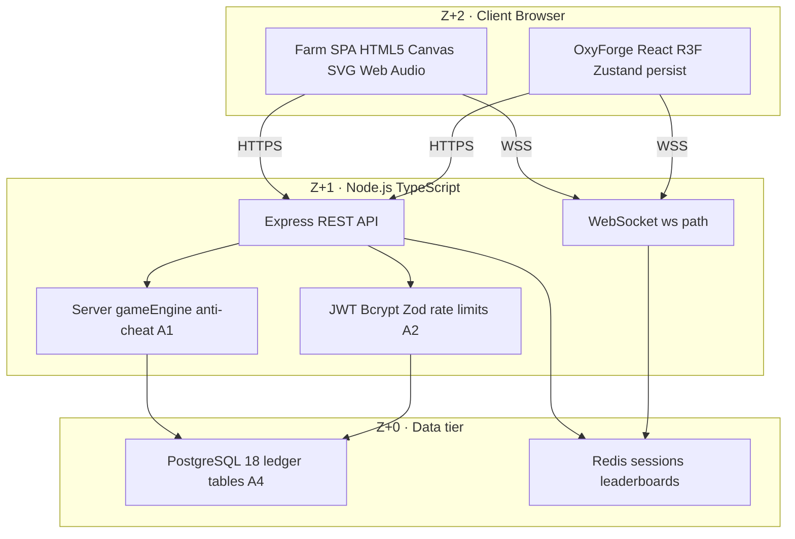
```mermaid
flowchart TB
    subgraph Z2_Client["Z+2 · Client Browser"]
        direction TB
        FARM["Farm SPA HTML5 Canvas SVG Web Audio"]
        OXY["OxyForge React R3F Zustand persist"]
    end

    subgraph Z1_Backend["Z+1 · Node.js TypeScript"]
        direction TB
        REST["Express REST API"]
        WSS["WebSocket ws path"]
        ENGINE["Server gameEngine anti-cheat A1"]
        SEC["JWT Bcrypt Zod rate limits A2"]
    end

    subgraph Z0_Stores["Z+0 · Data tier"]
        direction LR
        PG["PostgreSQL 18 ledger tables A4"]
        RD["Redis sessions leaderboards"]
    end

    FARM -->|HTTPS| REST
    OXY -->|HTTPS| REST
    FARM -->|WSS| WSS
    OXY -->|WSS| WSS
    REST --> ENGINE
    REST --> SEC
    ENGINE --> PG
    SEC --> PG
    REST --> RD
    WSS --> RD
```

### Production Security Specifications
- **Server-Authoritative Game Engine (§A1):** The frontend only dispatches player intent (`plantTree`, `harvest`, `claimTask`). The server recomputes elapsed game time from stored timestamps, calculates biological decay, validates wood salvage, and rejects client time manipulation.
- **Robust Session Security (§A2):** Passwords hashed via Bcrypt (cost 12). Short-lived JWTs held strictly in memory; refresh tokens stored in secure, `HttpOnly`, `SameSite=Strict` cookies to eliminate XSS token theft.
- **Append-Only Economy Ledger (§A4):** All Euro and Oxygen transactions are recorded in an append-only `economy_transactions` double-entry ledger, providing tamper-evident audit trails.

---

## 🚀 Getting Started & Local Development

### Prerequisites
- **Node.js:** v20+ or v24 LTS
- **Package Manager:** `npm` (included with Node.js)
- **Database (Optional for Backend API):** PostgreSQL 18 & Redis (in-memory fallbacks included)

### Option 1: Standalone Frontend Execution (Zero Build Steps)
The frontend is completely self-contained. Open `index.html` directly in any modern web browser, or serve it locally:

```bash
# Serve frontend locally using any static web server:
npx serve .
# Or Python:
python -m http.server 8080
```
Navigate to `http://localhost:8080` to play immediately!

---

### Option 2: Full-Stack Execution (Frontend + Express / TypeScript Backend)

1. **Clone the Repository:**
   ```bash
   git clone https://github.com/mishu-anik23/searchO2.git
   cd searchO2
   ```

2. **Install Backend Dependencies:**
   ```bash
   cd backend
   npm install
   ```

3. **Configure Environment Variables:**
   ```bash
   cp .env.example .env
   ```

4. **Run Database Migrations (PostgreSQL):**
   ```bash
   npm run db:migrate
   ```

5. **Start Backend in Development Mode:**
   ```bash
   npm run dev
   ```
   The backend server initializes on `http://localhost:5000` with WebSocket support mounted on `ws://localhost:5000/ws`.

6. **Build for Production:**
   ```bash
   npm run build
   npm start
   ```

---

## 🧪 Automated Testing & Verification

### 1. Backend Automated Jest Tests (14/14 Specs)
Verifies authentication, server-authoritative simulation, ledger auditing, rate-limiting, and guest upgrades:

```bash
cd backend
npm test
```

```
PASS tests/api.test.ts (16.923 s)
  searchO2 Phase 2 Backend & Security Test Suite
    1. Health Check & Diagnostics
      √ GET /api/health returns healthy database status (574 ms)
    2. Authentication Suite (Basic, Google, Guest & Upgrade)
      √ POST /api/auth/register creates user with bcrypt cost 12 and initial farm (693 ms)
      √ POST /api/auth/login logs in registered user with credentials (355 ms)
      √ POST /api/auth/login rejects invalid credentials (384 ms)
      √ POST /api/auth/guest creates an anonymous session with starter farm (36 ms)
      √ POST /api/auth/upgrade seamlessly converts guest account into registered user (351 ms)
      √ POST /api/auth/google verifies Google credentials in development sandbox (28 ms)
    3. Server-Authoritative Game Simulation & Anti-Cheat
      √ GET /api/farm retrieves authoritatively calculated farm state (28 ms)
      √ POST /api/farm/plots/0/prep starts digging and updates ledger (73 ms)
      √ POST /api/farm/plots/0/plant fails if plot is not ready (anti-cheat) (20 ms)
      √ Dead tree lifecycle and salvage removal engine (1 ms)
    4. Append-Only Economy Ledger & Audit
      √ GET /api/economy/transactions returns tamper-proof transaction log (16 ms)
      √ GET /api/economy/audit verifies balance against sum of ledger rows (15 ms)
    5. Public Leaderboard
      √ GET /api/leaderboard returns rankings with cache headers (27 ms)

Test Suites: 1 passed, 1 total
Tests:       14 passed, 14 total
Snapshots:   0 total
Time:        18.74 s
```

### 2. Frontend Headless Puppeteer & Simulation Test Suites
Verifies 3D decagonal flower garden rendering, polyculture companion guild bonuses, SVG graphics, and 10-day unattended economy health:

```bash
# Run 3D Decagonal Garden & Polyculture Puppeteer Suite:
node scratch/test_flower_garden_3d.js

# Verify HTML syntax, CSS braces, and economy stability:
node scratch/verify_menu_economy.js
node scratch/run_actual_economy_test.js
```

---

## 🗺️ Project Delivery Roadmap

```
  ┌───────────────────────────────────────────────────────────────────────┐
  │                           DELIVERY PHASING                            │
  ├───────────────────────────────────────────────────────────────────────┤
  │ [Phase 1: Core Loop MVP] ────────────────────────────────► COMPLETED  │
  │   • 6 Plots, 18 Trees, Storage Barn, Village Promenade, Audio Engine  │
  │   • Manhattan Grid Logistics, Zen HUD, Mobile Landscape Refactor      │
  │                                                                       │
  │ [Phase 2: Production Backend API] ───────────────────────► COMPLETED  │
  │   • Node.js/TypeScript REST API, PostgreSQL 18, Ledger Audit          │
  │   • Bcrypt/JWT Auth, WebSocket Sync, 14/14 Jest Test Specs            │
  │                                                                       │
  │ [Phase 3: Clean Energy Grid & Polyculture Systems] ──────► COMPLETED  │
  │   • 4-Corner Perimeter Wind Turbines & 500 kWh BESS Substation        │
  │   • 3D Decagonal 3-Sector Polyculture Flower Garden & Pollinators     │
  │   • Octagonal 4-Quadrant Crop Field & Livestock Silvopasture Farm     │
  │   • Living Botanical Encyclopedia (72 Trees, 12 Flowers, 6 Guides)    │
  │   • 3D Isometric Tree Canopies & Dynamic Pedestrian Visitor Remarks   │
  │                                                                       │
  │ [Phase 4: Planetary Expansion & Classroom Eco-Rankings] ─► IN PROGRESS │
  │   • Interactive Sustainability Quiz Engine with Coin/Seed Rewards     │
  │   • Multi-Biome Unlock Pipeline (Amazon, Kenya, Japan, Nordic Taiga)  │
  │   • Global School & Classroom Eco-Leaderboards                        │
  └───────────────────────────────────────────────────────────────────────┘
```

---

## 🤝 Contributing & License

Contributions are warmly welcomed from educators, environmental scientists, game designers, and software engineers!

1. Fork the Project repository.
2. Create your Feature Branch (`git checkout -b feature/AmazingEcoFeature`).
3. Commit your changes (`git commit -m 'feat: add interactive pollination mini-game'`).
4. Push to the Branch (`git push origin feature/AmazingEcoFeature`).
5. Open a Pull Request.

### License
Distributed under the **MIT License**. See [`LICENSE`](LICENSE) for complete terms.

---

<p align="center">
  <b>searchO2</b> — Empowering the next generation with regenerative agroforestry, clean energy, and environmental stewardship. 🌲💨🔋🌸🌍
</p>
