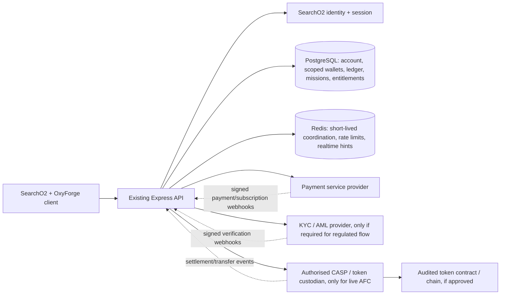

# SearchO2 + OxyForge: Economy, AFC, Payments, Identity, and Security Plan

**Prepared:** 30 September 2026  
**Scope:** Proposed implementation plan only. No repository files were changed for this plan.  
**Product assumption:** SearchO2 and OxyForge share one person/account identity. SearchO2 starts with a virtual farm balance of **€10,000**. OxyForge is playable only after sign-in and requires an active premium entitlement for premium missions/features.

> This plan is an engineering/product proposal, not legal, tax, payments, or investment advice. Before offering an AFC token, holding user funds, or promising conversion/redemption, obtain written advice from EU/German payments and crypto-asset counsel and written underwriting approval from each payment provider. The legal classification follows the rights and actual operation of AFC, not the label “utility coin.”

## 1. Executive recommendation

Build a single SearchO2 account and a server-authoritative account ledger first. Do **not** launch a public, tradable, EUR-pegged AFC token in the first release. The stated fixed relationship—**€1 : 200 AFC : 2,000 game units**—could be interpreted as a value or redemption promise. If AFC is redeemable or transferable as a value-stable instrument, issuing/custodying it may require regulated entities, authorisation, reserves, redemption processes, disclosures, and other obligations under EU rules. A bespoke token contract does not remove those obligations.

Use these distinct units in the product and database:

1. **Real EUR:** money paid or returned through a licensed payment provider. Do not store raw card or bank credentials.
2. **AFC:** only create an on-chain coin after classification and licensing are settled. Until then, either do not expose AFC or prototype it as an internal, non-transferable test unit with no promise of cash redemption, subject to counsel’s classification.
3. **Game credits (GC):** non-cashable, non-transferable simulation units used for SearchO2/OxyForge play. Call them “Game Credits” in UI; don’t use the EUR sign for them. The SearchO2 €10,000 is an existing **virtual game balance**, not €10,000 in real money.

For economy continuity, give each user one SearchO2 identity and one auditable ledger, with **game-scoped spendable balances** and explicit recorded transfers between SearchO2 and OxyForge. This preserves SearchO2’s €10,000 virtual starting budget while allowing a player to move earned game credits toward an OxyForge mission. A fully fungible balance plus an additional €250,000 OxyForge welcome grant would change SearchO2’s starting economy dramatically; if you want that instead, retune SearchO2 prices and progression deliberately.

Keep real-money checkout for **premium SaaS access** separate from the virtual game economy. A successful subscription enables server-side product entitlements; it should not silently mint AFC or game credits. If you also intend real-EUR-to-AFC purchases, treat that as a separate, compliance-gated product with its own approved provider and risk controls.

## 2. Current repository and backend findings

The inspected `main` ref is `origin/main` at `1272f75`. The checked-out branch is `oxyforge-local-v1`; the two refs have **no Git merge base**. This is not a normal feature branch that can safely be merged wholesale.

`main` currently has:

- A vanilla HTML/JavaScript frontend (`index.html`) and a separate Express/TypeScript service under `backend/`.
- PostgreSQL for users, farms, plots, refresh tokens, and the append-only `economy_transactions` farm ledger; Redis and WebSockets are also configured.
- Server-issued JWT authentication and guest accounts. `backend/src/modules/auth/auth.service.ts` creates a starter farm with **€10,000** and a `starter_grant` ledger entry. This plan follows the requested €10,000 baseline, not the €50 in README text.
- `farms.money` as the current farm balance and `economy_transactions` keyed to `farm_id`. `backend/src/modules/economy/economy.service.ts` audits the ledger sum against `farms.money`.
- No account-level shared wallet, AFC/token ledger, payment-provider integration, KYC workflow, subscription/entitlement tables, or OxyForge mission API on `main`.
- Existing guest upgrade/Google linking paths. They can change guest ownership and move a farm, but there is no registration field for an independent guest recovery credential. The current “first farm for user” lookup can make multiple farms ambiguous after a merge; the merge flow needs a defined multi-farm/save policy before reusing it.

OxyForge’s current code is a separate React/Three.js app with a local Zustand save/economy and a separate Better Auth setup. Its current save/client behavior cannot be trusted for money, mission price, subscription state, or payouts after launch. Port the game client into `main`, but use `main`’s authenticated user identity and backend as the authority. Avoid two independent user directories and login sessions.

The checked-out working tree was already dirty when inspected, with OxyForge component changes plus unrelated files. Keep it intact. Start the integration from a clean branch based on `main` and selectively port the game.

## 3. Economic model and conversion decision

### 3.1 The suggested rate

The proposed arithmetic is:

| Conversion | Arithmetic | Product interpretation |
|---|---:|---|
| Real EUR → AFC | €1 buys 200 AFC | A real-money purchase of a crypto-asset if AFC is an actual token. |
| AFC → game credits | 1 AFC grants 10 GC | An internal game conversion; make GC non-transferable and non-redeemable. |
| Real EUR → game credits | €1 grants 2,000 GC | Only valid as an internal game-credit rate; it is not a claim that GC can be cashed out for €1. |

The “=” signs should not be shown as if the three units have identical legal or redemption rights. Prefer wording such as **“€1 purchase amount → 200 AFC units → 2,000 non-cashable Game Credits”** only after the product and provider are approved. Show provider fees, exchange/issue timing, refund limitations, and any network fee before confirmation.

If AFC is redeemable for €0.005 per coin, transferable to other people, or marketed as tracking that value, do not assume it is a harmless game token. ESMA’s MiCA materials distinguish utility tokens from asset-referenced and e-money tokens; MiCA Article 59 says crypto-asset services in the EU generally require an authorised CASP or an eligible regulated financial entity. An e-money token is subject to issuer-specific requirements. The exact classification depends on design and facts and must be obtained from counsel. See [MiCA text (EUR-Lex)](https://eur-lex.europa.eu/eli/reg/2023/1114/oj/eng), [ESMA MiCA rulebook](https://www.esma.europa.eu/publications-and-data/interactive-single-rulebook/mica), and [MiCA Article 59](https://www.esma.europa.eu/publications-and-data/interactive-single-rulebook/mica/article-59-authorisation).

### 3.2 Preserve the €10,000 SearchO2 start

Recommended launch structure:

- SearchO2 starts with **€10,000 of virtual game balance**, exactly once per new account, recorded as a grant. This is not a bank deposit or real EUR.
- OxyForge has its own **Game Credit** balance. If the proposed €250,000 is retained, display it as `250,000 GC`, not `€250,000`, and make clear it is an OxyForge-only one-time simulation grant.
- Permit explicit, auditable transfers of **earned** virtual credits between game balances at a server-defined rate and with server-side limits. Decide whether the OxyForge welcome grant itself is transferable; recommendation: **no**, to protect SearchO2 pacing.
- Do not call virtual farm/mission balance an “EUR Account” in payment/KYC screens. Use “virtual account,” “farm balance,” or “Game Credits.” Reserve “EUR wallet/account” for real-money balance managed by a regulated provider or a legally reviewed account model.

This is a shared user/account and interconnected economy, while protecting SearchO2 from an OxyForge launch grant that is 25 times its €10,000 starting balance. If you require a single fully fungible virtual balance instead, then €250,000 becomes the common starting amount and the SearchO2 farm economy needs an explicit rebalancing pass.

### 3.3 OxyForge scale-down baseline

Treat the supplied numbers as approved design inputs to validate, not as finished prices:

| OxyForge setting | Proposed value | Notes |
|---|---:|---|
| Initial OxyForge funds | 250,000 GC | One-time only; no login refill. |
| Hauler Moon mission | 16,000 GC | Explicit user target; this is lower than 185,000 ÷ 10 = 18,500. |
| Hauler Mars mission | 92,000 GC | Exactly 920,000 ÷ 10. |
| FPV use | 15 GC/second | Explicit target; use this instead of 180 ÷ 10 = 18. |
| Other launch prices, contracts, oxygen sale, and costs | Start from old value ÷ 10 | Publish a full price table and simulate mission margins before release. |

If the old crewed launch prices are retained proportionally, a first approximation is Moon 46,500 GC and Mars 178,000 GC; set final values intentionally. Do not scale prices without scaling contract rewards, oxygen revenue, operating costs, and recurring costs together, or the game’s profitability changes.

## 4. Recommended target architecture

Keep PostgreSQL the source of truth for game balances, mission state, subscriptions, payment references, guest recovery claims, and audit history. Redis is useful for locks, throttling, WebSocket fan-out, and short-lived challenges, but it must not be the only record of a balance or payment. The blockchain is authoritative for on-chain AFC supply/ownership; your backend mirrors external chain events and provider custody positions for the user interface and reconciliation.

## 5. Suggested data model

Use append-only, immutable ledger entries and idempotent commands. Store real EUR as integer cents (`BIGINT`), token quantities as integer base units, and GC as integer units. Never calculate or persist financial values with JavaScript floating-point arithmetic.

| Table | Purpose / critical fields |
|---|---|
| `accounts` / existing `users` | Keep `users.id` as the stable identity. Add account status, email-verification time, MFA state, and risk flags as needed. Do not put payment/KYC secrets in profile JSON. |
| `game_wallets` | `id`, `user_id`, `game` (`searcho2` / `oxyforge`), `asset` (`GC` / `AFC` / `EUR` only if counsel/provider approves), integer `balance_units`, status, timestamps. Unique `(user_id, game, asset)`. Decide whether an all-games wallet is allowed; recommendation is scoped balances plus explicit transfers. |
| `wallet_ledger` | `wallet_id`, signed integer amount, `balance_after`, type, `source_game`, `reference_type/id`, `idempotency_key`, actor, timestamp. Unique idempotency key; do not edit/delete posted entries—reverse with a compensating entry. |
| `wallet_transfers` | Source/destination wallet, exact quote/rate version, amounts, status, idempotency key. Debit and credit both happen in one DB transaction. |
| `oxyforge_missions` | Owner `user_id`, destination, vehicle, authoritative price, status (`reserved`, `started`, `completed`, `aborted`, `failed`), stage, save JSON/version, idempotency key, timestamps. Only server-controlled state can trigger a payout. |
| `fpv_sessions` | Owner, mission, opened/last heartbeat/closed times, status, billed seconds, rate version, idempotency key. Expire on heartbeat timeout. |
| `subscriptions` / `entitlements` | Provider customer and subscription IDs, product/price, provider status, current paid-through time, cancellation/grace status, and derived entitlement. Entitlement is calculated on the server. |
| `payment_orders` / `provider_events` | Internal order, provider ID, currency/amount, status, refund/dispute state; webhook inbox with unique provider event ID, signature-verification result, processing state, and timestamps. |
| `guest_recovery_secrets` | Guest user ID, salted hash of high-entropy recovery code, created/rotated/consumed/expiry times, failed-attempt counters. Never store the recovery code in plaintext. |
| `account_merge_jobs` | Source guest, destination registered user, request state, idempotency key, data/balance reconciliation result, operator/audit metadata. Unique source-user constraint prevents replay. |
| `kyc_cases` | Provider case/reference, user, current status, reason category, timestamps, decision source. Keep identity document images with the KYC provider where possible; store only minimal status/reference locally. |
| `token_positions` (conditional) | Internal mirrored chain/custodian positions, chain/network/contract, wallet reference, token base units, confirmation status, last reconciled block/event. Never treat an unconfirmed chain event as final spendable value. |

For migration, backfill each existing farm’s **current** `farms.money` once into its owner’s SearchO2 scoped wallet, preserve farm-level histories, and write a migration ledger entry with the original farm ID. Do not sum historical transaction rows and `farms.money` into the new wallet; that would double count. Add a reconciliation report and a dry-run balance comparison before cutover. During transition, choose one source of truth and update both values atomically if the legacy farm field must temporarily remain as a read-model.

## 6. Payments, methods, real-time crediting, and subscriptions

### 6.1 Payment-service-provider approach

Do not integrate Visa, Mastercard, SEPA, Klarna, and PayPal as if each were a direct bank API:

- **Visa / Mastercard:** card schemes; accept through an acquiring payment provider.
- **SEPA:** distinguish push bank transfer (including SEPA Instant, where offered) from SEPA Direct Debit. Direct Debit is delayed and can be returned/disputed well after initiation. Do not credit irreversible AFC just because the customer started a debit.
- **PayPal:** either a separate PayPal Checkout/Subscriptions adapter or a PSP feature, subject to business-model approval.
- **Klarna:** a buy-now/pay-later option, not a generic bank transfer. Do not assume it supports subscription billing or crypto/AFC top-ups. Get written approval for the exact product before enabling it.

For a European launch, evaluate **Adyen** as a single PSP integration for cards, PayPal, Klarna, and SEPA methods; it documents these methods and notes material SEPA Direct Debit return/chargeback risk. Alternatively use **Stripe Checkout/Billing** for SaaS subscriptions and cards/SEPA, with PayPal as a separate adapter if needed. Select only after confirming country coverage, digital/SaaS approval, recurring support, AFC/crypto business-model acceptance, settlement currencies, refund/dispute API, and pricing in writing. Keep a provider interface (`createCheckout`, `capture`, `refund`, `createSubscription`, `verifyWebhook`) so the backend can change PSP without changing wallet rules.

Official references: [Adyen payment method setup](https://docs.adyen.com/standard/integration/payment-method-setup), [Adyen SEPA Direct Debit and its risk/mandate details](https://docs.adyen.com/payment-methods/sepa-direct-debit), [Adyen Klarna integration](https://docs.adyen.com/payment-methods/klarna/), [PayPal Orders API server-side integration](https://developer.paypal.com/api/rest/integration/orders-api), and [PayPal webhooks](https://developer.paypal.com/api/rest/webhooks).

### 6.2 Real-money top-up flow (only if approved)

1. Authenticated user creates an internal `payment_order`; server chooses the product, amount, currency, fee, and quote/version. Client never supplies a trusted credit amount or exchange rate.
2. Before checkout, enforce account age/region and required KYC/risk state. Use PSP-hosted checkout/hosted fields and keep PAN/CVV/IBAN out of your servers whenever possible.
3. Provider returns to the app; a return URL is **not** proof of payment. Show “processing” until a verified server webhook or authoritative provider status confirms settlement.
4. Verify webhook signature against the exact raw body, validate account/order/amount/currency/provider IDs, insert a unique provider event, and process idempotently.
5. Credit real-EUR claim/AFC only after the approved settlement milestone. For SEPA Direct Debit or other reversible methods, apply a risk hold or delay; if a payment reverses after value is spent, freeze the relevant balance and open a recoverable negative/collections case according to policy.
6. Reconcile provider settlement reports against orders and ledger daily. Support refunds, chargebacks, duplicate/out-of-order events, and provider outages.

Do not enable card/Klarna/PayPal/SEPA top-ups for AFC until each provider has approved the activity. A provider’s generic checkout API availability is not approval to sell or issue crypto-assets.

### 6.3 Premium SaaS recurring billing

Represent subscription state separately from wallets: `incomplete`, `trialing`, `active`, `past_due`, `cancel_at_period_end`, `canceled`, `unpaid`, and provider-specific pending states. Grant OxyForge entitlement only from verified provider state and a paid-through date. Define a short, published grace period for failed renewals; block new premium mission starts when entitlement expires, while preserving saved game data and ledger history. A canceled renewal usually retains access through its paid-through date; derive this from the provider’s canonical status.

For near-real-time behavior, use provider webhooks as the truth, commit the entitlement update, then notify the active client over the existing WebSocket or make it refetch `/api/account/entitlements`. Handle duplicate, delayed, and out-of-order webhook events. Do not grant subscription access from a browser success page. Payment-provider docs describe webhooks for subscription changes; see [PayPal webhooks](https://developer.paypal.com/api/rest/webhooks) and the selected PSP’s subscription documentation.

## 7. KYC / identity-verification interface

KYC is needed only if the chosen real-money/token business model and providers require it; it is not a substitute for legal classification. Use a hosted or redirectable identity-verification provider that provides an API, signed webhooks, manual-review states, data-region/retention controls, and a clear DPA. Build a provider-neutral adapter; compare vendors in procurement rather than locking the app to one vendor’s case schema.

Suggested user experience:

1. User signs in and completes email verification and MFA/passkey enrollment.
2. If a gated action requires verification, explain why, what categories of data are requested, the provider receiving it, retention/contact details, and how to appeal. Then open the provider-hosted flow.
3. Backend creates the KYC case and maps only a random opaque `case_id` to `user_id`. The provider collects ID/selfie/address data directly where possible.
4. Verify webhook signatures and state transitions. Store status such as `not_started`, `pending`, `verified`, `rejected`, `needs_review`, `expired`; store reason codes only as needed. Do not accept a client’s `verified: true` value.
5. Apply region/product eligibility and transaction limits server-side. Offer a human review/appeal route for false rejects; restrict reviewer access and log it.
6. Define retention/deletion and legal hold rules with counsel. Encrypt sensitive fields, keep them out of analytics/logs, and don’t use KYC images for gameplay or marketing.

Do not add KYC to ordinary SearchO2 farming if it is not required; keep it proportionate to the actual regulated/risk-bearing feature. If the app is used by children, use an adult account/payer model and obtain specialist privacy advice before collecting identity documents or introducing financial products to child-facing flows.

## 8. AFC technology and wallet handling

### Phase 1 — safest useful delivery

- Implement **AFC as an internal test ledger unit only**, clearly marked as a closed-loop prototype; no chain, external wallet, exchange, cash withdrawal, peer-to-peer transfer, or guaranteed euro redemption.
- Do not market the test unit as “crypto,” “stable,” “€-pegged,” or an investment. Get counsel’s written classification before launch; even a non-transferable token can have regulatory implications depending on design and offer.
- Build wallet/ledger APIs with asset codes so the later chain adapter will not require a financial rewrite.

### Phase 2 — only after legal and partner approval

- Prefer a regulated CASP/custody provider with EU authorization appropriate to the exact custody/transfer service. Use its hosted/embedded custody and KYC features where suitable; keep private keys and recovery phrases out of SearchO2 systems. Check the provider against ESMA’s register and verify the authorization/service scope, not just a marketing claim.
- Commission independent smart-contract and key-management audits, threat modeling, and an incident/recovery plan. Use contract roles with multi-party controls and timelocks for administrative actions; protect issuer keys with an HSM/MPC service operated by the qualified provider. No developer laptop or single hot key can mint, pause, or move customer assets.
- Implement mint/burn reconciliation: verified settled fiat (or approved reserve movement) ↔ token mint/burn ↔ provider/chain position ↔ internal ledger. Define chain confirmations, reorg handling, stuck transfer support, sanctions screening, address risk controls, key rotation, and incident freeze procedures.
- Keep treasury/reserves and user assets legally and operationally segregated as required by the model. Define redemption rights, fees, settlement cutoffs, reserve reconciliation, complaints, and insolvency scenarios before promising a peg.
- If users transfer crypto to/from external addresses, assess the EU Transfer of Funds “travel rule” and CASP obligations with counsel/provider; EBA guidance covers information requirements for PSP/CASP transfers ([EBA travel-rule guidelines](https://www.eba.europa.eu/activities/single-rulebook/regulatory-activities/anti-money-laundering-and-countering-financing-terrorism/guidelines-information-requirements-relation-transfers-funds-and-certain-crypto-assets-transfers)).

MiCA references: [ESMA MiCA overview/rulebook](https://www.esma.europa.eu/esmas-activities/digital-finance-and-innovation/markets-crypto-assets-regulation-mica), [Article 59 CASP authorisation](https://www.esma.europa.eu/publications-and-data/interactive-single-rulebook/mica/article-59-authorisation), [Article 75 custody requirements](https://www.esma.europa.eu/publications-and-data/interactive-single-rulebook/mica/article-75-providing-custody-and), and [EUR-Lex Regulation 2023/1114](https://eur-lex.europa.eu/eli/reg/2023/1114/oj/eng).

## 9. User accounts and guest-data recovery/merge

OxyForge should require a registered, verified account before mission play. SearchO2 may continue to support guest play. A guest’s current database user/farm is not recoverable from another browser unless the user can prove possession of a recovery secret; an internal UUID or display name is not proof.

### Guest recovery credential

- When a guest session is created, generate a cryptographically random, high-entropy recovery code (e.g. 128+ random bits, encoded as grouped base32 with a checksum). Display it once with clear “save this code” instructions and a copy/download option.
- Store only a slow salted hash of the code, plus guest owner, status, expiry/rotation metadata, and failed-attempt count. Never use sequential IDs, email, or guessable names as credentials. Rate-limit attempts per account, IP/device, and code prefix; alert on abuse.
- Recovery code proves access to that guest profile; it is not a password, public guest ID, payment credential, or replacement for signing in to the destination account. Permit rotation after the guest is recovered.
- Because OxyForge requires login, don’t let an unregistered guest launch an OxyForge premium mission. Preserve a local guest game save only as a recoverable SearchO2 guest profile until the user registers.

### Registration/merge choices

At registration, offer:

1. **Continue this browser’s guest profile** — upgrade the current guest in place, preserving its farm/save and balance. This is the preferred path and aligns with the existing guest-upgrade idea.
2. **Recover another guest profile** — after registration and sign-in to the destination account, enter the guest recovery code. Require fresh password/passkey reauthentication before linking. This is the cross-browser path the user described.
3. **Start fresh** — create a new profile without importing guest state. Retain the old guest only for the defined expiry period, then purge under the retention policy. Show a final confirmation of which game progress will not be carried over.

Never let the form accept a bare `guest_id` as proof. The UI can show a non-secret profile label/short fingerprint to help the user select the right save, but the server verifies the recovery secret.

### Safe merge behavior

- Merge only **guest → authenticated destination user**. Never merge two registered accounts by entering an ID.
- Run one PostgreSQL transaction under row locks: validate destination session/reauth, verify and consume the guest code once, confirm source is still a guest, create a merge job, transfer ownership of all source saves/farms/achievements, resolve default-save selection, revoke guest refresh tokens/sessions, and write an immutable audit event. Make the request idempotent and safe to retry.
- Do not silently discard a guest farm when the registered user already has a farm. `main`’s current code often selects the first farm for a user; change this to support multiple named saves/farms or provide an explicit, reviewed merge policy before claiming the merge is complete. Preserve each save separately as the default; let the user choose the active farm.
- Prevent duplicate starter grants. If both guest and destination profiles each received €10,000, do not automatically add both grants into the shared spendable wallet. Preserve each profile’s gameplay and ledger provenance, then apply a published one-time merge-credit policy. If balances become one wallet, calculate the adjustment from ledger entries and record a `merge_adjustment`/transfer rather than editing balances invisibly. Flag ambiguous historical balances for support review.
- Keep the destination account’s subscription, MFA methods, payment methods, and KYC status authoritative. Do not merge guest identity documents, guest login secrets, or a subscription into the registered profile. Revoke all source guest tokens, issue a fresh destination session, and notify the user.
- Provide support-reviewed recovery when the user lost the code; require stronger proof and audit it. Don’t provide an admin “merge by email/ID only” shortcut.

## 10. Security and operational requirements

### Authentication and account security

- Reuse SearchO2’s identity/session system; production cookies should be `Secure`, `HttpOnly`, appropriately `SameSite`, narrowly scoped, and rotated. Keep access tokens short-lived and refresh tokens hashed/rotated/revocable. Protect state-changing cookie-authenticated requests against CSRF and enforce allowed origins.
- Require verified email and MFA/passkeys before cash/AFC actions, account merge, external-wallet change, payout, KYC-sensitive admin action, or credential change. Require recent reauthentication for high-risk actions.
- Use Argon2id or a deliberately maintained password-hashing configuration. The existing backend uses bcrypt with cost 12; review current parameters and migration compatibility rather than inventing a custom scheme.
- Apply authorization checks by authenticated user on every request; never trust `farmId`, amount, exchange rate, mission cost, subscription state, or KYC status from the client.

### Ledger and payment protections

- Use database transactions, row-level locks, unique idempotency keys, immutable ledger entries, reversal entries, and periodic balance/settlement reconciliation. Prevent negative balances with a conditional update or locked check in the same transaction.
- Verify each provider webhook signature using the raw body; dedupe provider event IDs; tolerate retries/out-of-order events; log a minimal redacted event trail. Keep webhook signing secrets in a secret manager, rotate them, and never log secrets, full bank details, card data, ID images, access tokens, recovery codes, or private keys.
- Add rate limits and velocity limits to checkout, mission start, FPV, transfers, recovery attempts, merge operations, and withdrawals. Add anomaly alerts for repeated failed KYC, rapid top-ups/spends, chargebacks, unusual wallet changes, and admin adjustments.
- Use provider-hosted card/bank entry to minimize PCI scope. Never store CVV. Store only provider tokens/references and masked display data. For SEPA, persist mandate reference/status and payment notice facts, not a raw IBAN unless a reviewed business need requires it.
- Admin adjustments require reason codes, ticket/reference, step-up auth, role separation, and append-only audit log. No admin SQL edits to user balances.

### AFC-specific risks (only if live token is approved)

- Separate mint, burn, pause, treasury, and customer-support roles; multi-party approval; hardware-backed secrets; withdrawal allowlists/cooldowns and risk checks; chain/network allowlist; address screening; rate/amount limits; reconciliation; emergency pause and a tested recovery runbook.
- Do not expose seed phrases to support staff or store them in application database, logs, browser localStorage, analytics, or crash reports. If self-custody is offered, users—not SearchO2 support—control recovery; make that product choice explicit.
- Treat a blockchain transfer as pending until the chosen finality policy is met. Handle chain reorgs, wrong networks, mistaken addresses, gas shortage, compromised keys, and vendor/chain outage.
- Keep user-facing AFC and game balance views clear about custodial/self-custodial status, fees, reversibility, redemption rights, and risks as required by counsel and provider contracts.

## 11. API shape (proposal)

All routes below require the existing authenticated user unless clearly a public provider webhook. Derive user identity from middleware.

| Route | Responsibility |
|---|---|
| `GET /api/account/summary` | User profile, scoped game balances, entitlements, selected saves; no secrets. |
| `GET /api/account/ledger?game=...` | Paginated, owner-scoped ledger history. |
| `POST /api/account/transfers` | Quote/commit an allowed virtual-credit transfer with idempotency key. Server chooses allowed rate/version. |
| `GET /api/oxyforge/entitlement` | Current verified premium status and paid-through date. |
| `POST /api/oxyforge/missions` | Server prices, checks entitlement/balance, debits, and creates the mission atomically. |
| `POST /api/oxyforge/missions/:id/actions` | Validate allowed next server-side mission step; calculate progress/rewards on server. |
| `POST /api/oxyforge/fpv-sessions` and `POST .../:id/heartbeat`, `DELETE .../:id` | Start, bill, heartbeat, stop; server computes elapsed time/rate. Do not charge once per rendered frame. |
| `POST /api/billing/checkout-session` | Create a provider session for the selected subscription SKU, never for a client-defined amount. |
| `POST /api/webhooks/payments/:provider` | Verify, dedupe, reconcile payment/refund/dispute events. |
| `POST /api/webhooks/subscriptions/:provider` | Verify, dedupe, update subscription and emit entitlement update. |
| `POST /api/guest/recovery-code` | Issue or rotate guest recovery secret while in that guest session. |
| `POST /api/account/guest-merges` | Recover and attach a guest profile to the authenticated account; idempotent transaction. |
| `POST /api/kyc/cases` and `POST /api/webhooks/kyc/:provider` | Start hosted case and verify status events if KYC is required. |
| `POST /api/webhooks/custody/:provider` | Receive custody/chain events only if AFC goes live; verify and reconcile. |

For payments and account changes, validate input with the backend’s existing Zod patterns. Use API versioning and audit payload schema changes.

## 12. Delivery sequence and gates

### Phase 0 — decisions and external approvals

- Confirm whether AFC is redeemable, transferable peer-to-peer, listed/tradable, usable outside SearchO2, or only a closed-loop game unit.
- Confirm who holds real EUR, who issues AFC, redemption process, allowed jurisdictions, adult/minor account rules, and subscription SKU/price.
- Obtain legal classification and provider written approval for the exact flow. If these are not approved, proceed only with virtual GC and premium SaaS subscription.
- Approve the complete GC price/reward sheet, including the €10,000 SearchO2 grant, €250,000 OxyForge proposal, Moon/Mars fees, contracts, oxygen, FPV rate, and transfer rules.

### Phase 1 — integrate the game without crypto

- Create a clean integration branch from `main`; port the OxyForge front end and assets into `/oxyforge/` or a same-origin bundled app.
- Use SearchO2 auth for OxyForge. Require login before OxyForge mission play. Keep SearchO2 guests if desired.
- Add game-scoped virtual wallets and ledger. Migrate existing `farms.money` carefully and compare every account balance before/after.
- Move OxyForge mission charge, FPV billing, completion reward, one-time grant, and save state to server APIs. Keep money display optimistic only until server response.
- Add account-scoped saves and the recovery-code merge flow. Make farm selection deterministic and visible.

### Phase 2 — premium SaaS billing

- Select a PSP and enable only approved recurring methods (usually cards first; add PayPal or SEPA where supported/appropriate). Klarna is optional and needs specific underwriting approval.
- Implement hosted checkout, customer portal/cancel flow, provider-event inbox, webhook verification, subscription status projection, entitlement service, refund/dispute handling, and support audit.
- Test active, renewal, failed payment, grace, cancellation-at-period-end, immediate cancellation, refund, dispute, webhook retry/out-of-order, and account deletion flows.

### Phase 3 — KYC or AFC pilot, only if needed

- Launch a small, jurisdiction-limited closed pilot after legal/partner approval. Keep KYC provider data minimized and test manual review, rejection, appeal, deletion, and webhook replay.
- For live AFC, use authorized custody/issuance partners, completed operational policies, independent contract audits, key ceremonies, reconciliation, reserves/redemption readiness, incident response, and travel-rule handling before production minting/transfers.

### Phase 4 — rollout and operations

- Feature flag payment, AFC, transfers, KYC, and OxyForge premium independently. Use sandbox providers, internal accounts, low caps, and a limited rollout.
- Run daily balance/provider/chain reconciliations; alert on drift. Maintain support runbooks for chargebacks, stuck bank payments, KYC review, account recovery, mistaken transfers, key incidents, and provider outage.
- Maintain backup/restore tests for Postgres, migration rollback strategy, secret rotation, audit access review, vulnerability scans, penetration testing, and disaster recovery exercises.

### Release acceptance checks

- A fresh SearchO2 account receives exactly €10,000 **virtual farm balance once**; ordinary logins add nothing.
- OxyForge is blocked without an authenticated account and, where required, active premium entitlement.
- Mission costs and FPV charges are enforced by the server; two simultaneous requests/retries cannot overspend or double charge.
- One-time OxyForge grant is idempotent and doesn’t accidentally inflate the SearchO2 starting balance.
- Client edits to local storage, API payloads, client clock, or subscription redirects cannot mint money, lower prices, complete stages, or unlock premium features.
- Provider webhook duplicates, missing/delayed events, SEPA returns, card chargebacks, refunds, and subscription cancellation produce deterministic ledger/entitlement results.
- Guest recovery codes are high entropy, hashed, rate-limited, one-time/rotatable, and cannot be replaced by knowing a guest UUID. Merge preserves all saves, handles existing target farms, prevents duplicate grants, revokes old tokens, and can be safely retried.
- No negative spendable balance, unbalanced transfer, orphaned ledger entry, or unexplained provider/chain reconciliation difference is possible without an alert and incident record.

## 13. Decisions to make before implementation

1. Is AFC a genuinely transferable/redeemable crypto-asset, or should launch use non-cashable game credits only?
2. Does the €250,000 grant mean **250,000 OxyForge Game Credits** (recommended), or should all SearchO2 users’ shared balance become €250,000?
3. Can the one-time OxyForge grant be transferred into SearchO2? Recommendation: no; let earned credits transfer under explicit limits.
4. Are AFC purchases available at launch, or does launch sell premium subscriptions only? Recommendation: premium subscription first; no AFC top-ups until legal and PSP approval.
5. Which account merge rule should apply when both accounts already have farms? Recommendation: keep separate named saves under one registered user, don’t destructively combine farm fields.

## 14. Official references consulted

- [EUR-Lex: Regulation (EU) 2023/1114 (MiCA)](https://eur-lex.europa.eu/eli/reg/2023/1114/oj/eng)
- [ESMA: MiCA interactive rulebook](https://www.esma.europa.eu/publications-and-data/interactive-single-rulebook/mica)
- [ESMA: Article 59, CASP authorisation](https://www.esma.europa.eu/publications-and-data/interactive-single-rulebook/mica/article-59-authorisation)
- [ESMA: Article 75, custody and administration](https://www.esma.europa.eu/publications-and-data/interactive-single-rulebook/mica/article-75-providing-custody-and)
- [EBA: information requirements / travel-rule guidance](https://www.eba.europa.eu/activities/single-rulebook/regulatory-activities/anti-money-laundering-and-countering-financing-terrorism/guidelines-information-requirements-relation-transfers-funds-and-certain-crypto-assets-transfers)
- [Adyen: payment-method setup](https://docs.adyen.com/standard/integration/payment-method-setup)
- [Adyen: SEPA Direct Debit](https://docs.adyen.com/payment-methods/sepa-direct-debit)
- [Adyen: Klarna](https://docs.adyen.com/payment-methods/klarna/)
- [PayPal: Orders API integration](https://developer.paypal.com/api/rest/integration/orders-api)
- [PayPal: webhooks](https://developer.paypal.com/api/rest/webhooks)

